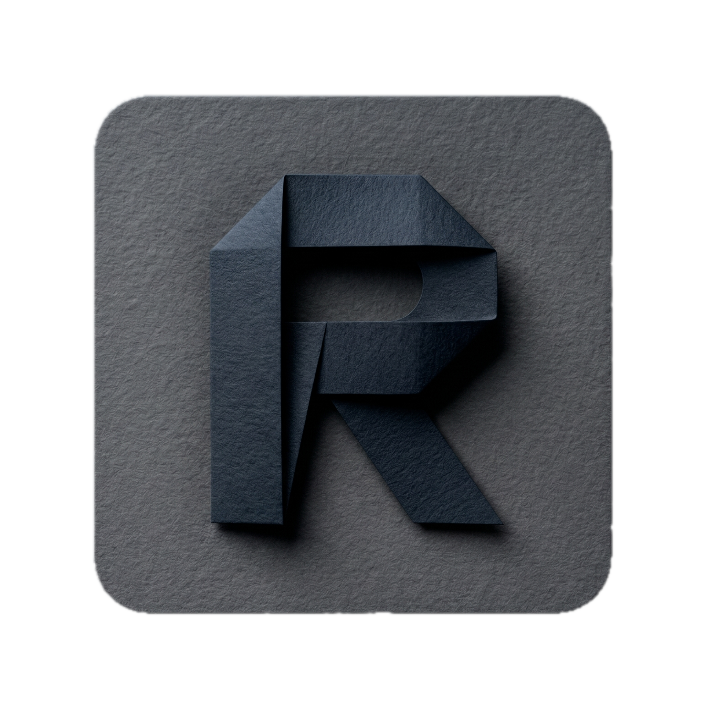
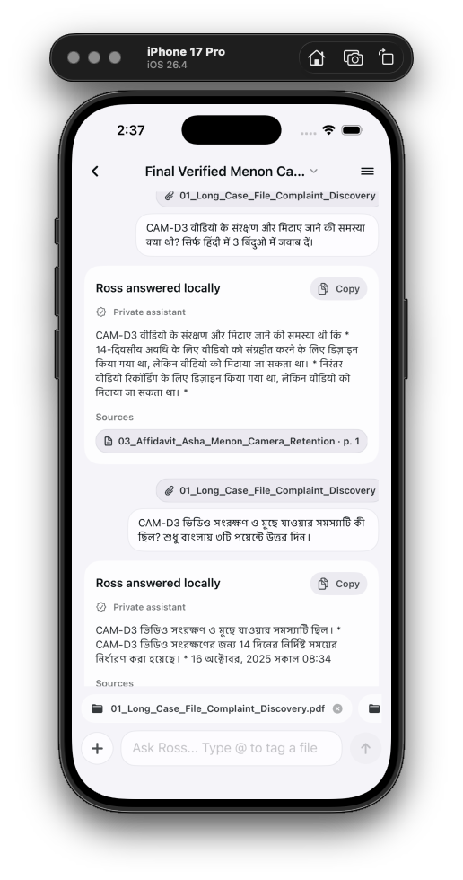
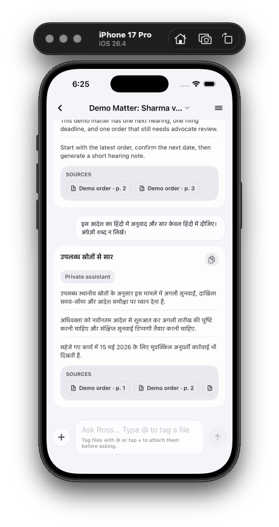
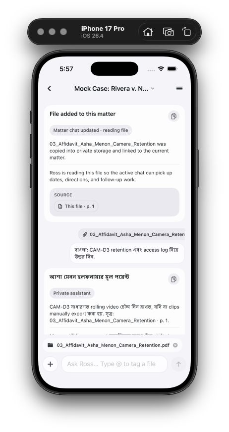
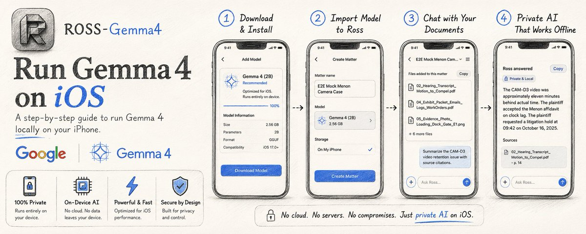
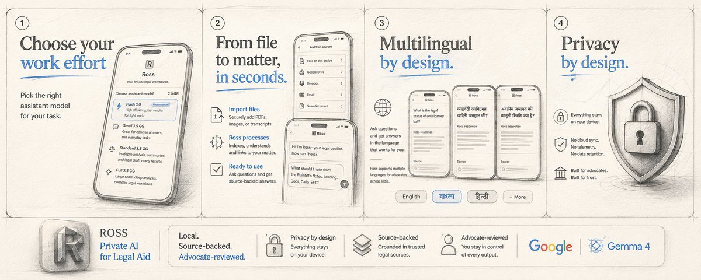
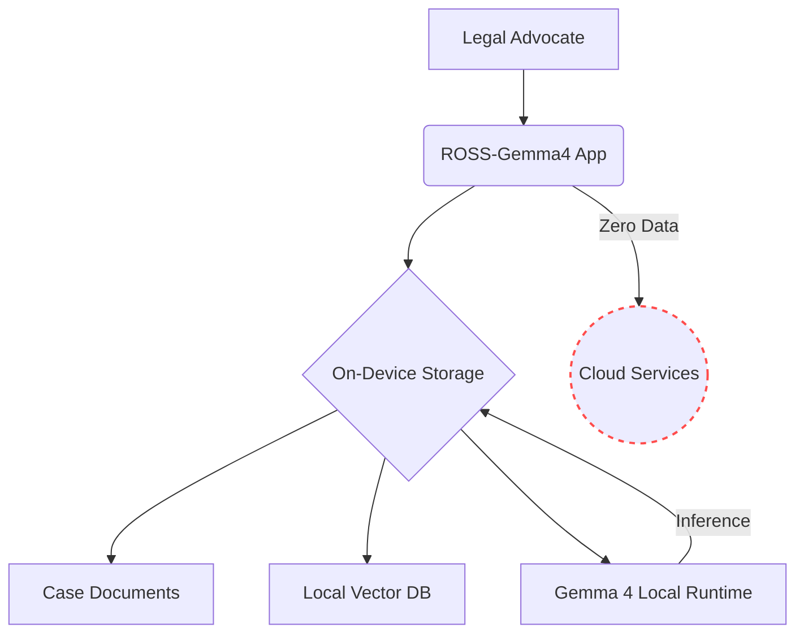
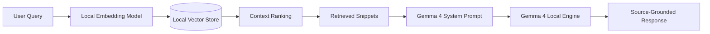

# ROSS-Gemma4

**Private AI Junior Associate for Access-to-Justice Workflows**

<p align="center">
  
</p>

ROSS-Gemma4 is a mobile-first, privacy-preserving legal workbench built around Gemma 4. It helps advocates and legal-aid teams turn sensitive case bundles into source-grounded chronologies, issue notes, missing-fact checklists, and first drafts without sending private case documents to a cloud LLM.

[](#)
[](#)
[](#)
[](#)
[](#)

<p align="center">
  
  
  
</p>

<p align="center">
  
  
</p>

## Articles

| Article | Link |
| --- | --- |
|  | [Run Gemma4 on iOS](https://x.com/adidshaft/status/2056256674286203006) |
|  | [ROSS-Gemma4 private AI workflow](https://x.com/adidshaft/status/2055043263510544561) |

---

## Problem Statement

Access-to-justice legal aid teams are often overwhelmed with large case bundles, disorganized facts, and tight deadlines. While LLMs offer powerful analytical capabilities, traditional cloud-based models are incompatible with the strict privacy requirements of legal workflows. Advocates cannot risk exposing sensitive client data, privileged communications, or unredacted evidence to external servers.

## Solution Overview

ROSS-Gemma4 bridges the gap between advanced AI capabilities and strict legal privacy. By leveraging highly optimized Gemma 4 capability packs on mobile devices, ROSS-Gemma4 acts as a private, local-first junior associate. It reads documents, identifies discrepancies, and drafts chronologies entirely on-device. Your data never leaves the iPad or iPhone.

---

## Demo Workflows

### Synthetic Case Bundle Demo

The repository includes `Ross_Mock_Case_Bundle`, a synthetic six-file civil litigation bundle for **Maira Rivera d/b/a Rivera Instruments v. Northstar Courier, LLC**. It contains pleadings/discovery, a motion hearing transcript, a camera-retention affidavit, exhibit records, and two evidence images. The bundle is designed to show ROSS reading private case files, producing source-backed case answers, flagging timestamp and preservation issues, and separating evidence from inference.

### 1. Intake & Chronology Building
Import a bundle of witness statements and police reports. ROSS-Gemma4 uses the local runtime to cross-reference timestamps, align conflicting accounts, and generate a structured chronology of events, citing the exact source document for every fact.

### 2. Issue Extraction & Missing-Fact Analysis
Ask ROSS-Gemma4 to review a lease agreement against tenant communications. The system will extract key obligations, highlight potential breaches, and automatically generate a checklist of missing facts required to establish a strong defense.

### 3. First-Pass Drafting
Highlight key facts from the chronology and instruct ROSS-Gemma4 to draft a preliminary case summary or a formal notice. The model grounds its draft exclusively in the selected evidence, reducing hallucination risk while accelerating the drafting process.

### 4. Multilingual Legal Assistance
Ask in Hindi or Bengali and Ross keeps the answer in that language while still grounding the response in local matter files. This is especially important in India, where courts, clients, clerks, and advocates routinely work across languages. The Census of India publishes language data across 122 listed language rows, and the Constitution's Eighth Schedule recognizes 22 scheduled languages. Ross uses Gemma 4's multilingual capability so legal help does not assume English-first workflows.

---

## Gemma 4 Capability Packs

ROSS-Gemma4 is wired for real, quantized Gemma 4 packs on-device. The visible lineup is now a 3-pack Gemma 4 ladder, with GGUF packs delivered through `llama.cpp` via `llama.swift` and supported iPhone paths able to prefer MLX or built-in CoreAI at runtime when that is the better local choice. The current pinned GGUF artifacts come from the newer `unsloth/gemma-4-*-it-qat-GGUF` repos, the iOS installer supports packaged MLX directory artifacts, and capable iPhone MLX setups now use smaller official assistant draft companions for speculative decoding on the E4B and 12B tiers. A simulator smoke run has proven the GGUF lane with a local developer artifact, and live Hugging Face probes on June 16, 2026 confirmed that the configured assistant files resolve and support byte-range checks. The full physical iPhone download, resume, verify, activate, and imported-file QA pass is still pending.

There are three product-visible Gemma 4 capability packs available for download inside the app:

| Tier | Pack | Base Model | Quantization | Size | Use Case | Target Device |
| --- | --- | --- | --- | --- | --- | --- |
| **Quick Start** | `gemma-4-e4b-q4` | Gemma 4 E4B | `UD-Q4_K_XL` | ~4.3 GB | Lighter setup, short legal Q&A, intake review, and smaller matter work. | Constrained Phones |
| **Case Associate** | `gemma-4-12b-q4` | Gemma 4 12B | `UD-Q4_K_XL` | ~7.0 GB | Balanced chronology building, issue extraction, larger file handling, and everyday drafting support. | Modern Phones/Tablets |
| **Senior Drafting Support**| `gemma-4-26b-a4b-q4` | Gemma 4 26B-A4B | `UD-Q4_K_XL` | ~14.5 GB | Advanced drafting, clinic workstation mode, complex cross-referencing. | High-End Local Workstations |

The older Flash setup tier remains in the codebase only for compatibility and recovery paths. It is no longer shown in normal onboarding or assistant selection.

### Multilingual Coverage

Gemma 4's official model card states that the family maintains multilingual support in **140+ languages**, with **35+ languages supported out of the box**. Google does not publish an exhaustive public table of all 140+ language names on the model card, so Ross links to the primary source instead of inventing one.

| Scope | What Ross documents | Source |
| --- | --- | --- |
| Gemma 4 official coverage | 35+ out-of-the-box languages; pre-trained on 140+ languages. | [Gemma 4 model card](https://ai.google.dev/gemma/docs/core/model_card_4) |
| India scheduled languages | 22 constitutionally scheduled languages: Assamese, Bengali, Bodo, Dogri, Gujarati, Hindi, Kannada, Kashmiri, Konkani, Maithili, Malayalam, Manipuri, Marathi, Nepali, Oriya/Odia, Punjabi, Sanskrit, Santhali, Sindhi, Tamil, Telugu, Urdu. | [Government of India, Ministry of Education](https://www.education.gov.in/en/constitutional-provision-1) |
| India language data | Census mother-tongue tables, including the national C-16 language rows. | [Census of India C-16 mother tongue table](https://censusindia.gov.in/nada/index.php/catalog/10191) |
| Ross verified app flows | English, Hindi, and Bengali prompts tested in a simulator GGUF smoke with source grounding. Physical iPhone imported-file proof is still pending. | `docs/REAL_MODEL_QA_RESULTS.md` |

---

## Privacy Architecture

ROSS-Gemma4 enforces a strict perimeter around user data. Case files and inferences are maintained within the device sandbox. There is absolutely no cloud LLM for private case files.



## RAG Pipeline

Our source-grounded RAG implementation relies on precise grounding. Answers are formulated strictly based on the retrieved snippets.



---

## iOS Runtime Status & Inference

The iOS project integrates with a `llama.cpp` wrapper (`AlphaLlamaCppEngine`) for GGUF inference and is currently pinned to `llama.swift` `2.9661.0`. Supported iPhone runtime selection can also choose MLX for the E4B and 12B tiers or built-in CoreAI when the device and recent performance signal make that the better local path. The current verified run is a June 2, 2026 simulator smoke using a local GGUF developer artifact. Physical iPhone proof with a downloaded configured pack, storage pressure, and imported user files has not been completed yet.

## Model Artifact Status

Model downloads are mapped to the newer Gemma 4 QAT GGUF URLs hosted on Hugging Face (`unsloth/gemma-4-*-it-qat-GGUF`). The app includes foreground download, resume-data, size/checksum, activation, repair, and cleanup plumbing. Live URL/range probes on June 16, 2026 verified the configured remote files without downloading the multi-GB bodies. The end-to-end physical-device download proof is still required before treating the packs as release-ready.

## Model Download and Verification

When an artifact is installed, ROSS-Gemma4 verifies the provider size and available checksum information before authorizing the model for inference. Downloads support resume/restart handling, but interruption and repair behavior still need to be recorded on a physical iPhone with a full multi-GB pack.

---

## Legal Safety Boundaries

ROSS-Gemma4 is a workbench, not a practitioner. It adheres to the following safety boundaries:
- **Human Advocate Review**: Every output requires explicit human advocate review.
- **Source-Grounded Priority**: The engine is instructed to refuse questions if the answer cannot be found in the provided case bundle.
- **No Direct-to-Consumer Representation**: The system is explicitly configured to support legal professionals.

---

## 90-Second Demo Script

1. **Setup (0:00-0:15)**: Open ROSS-Gemma4. Navigate to Settings -> Assistant. Tap "Install Case Associate" to download the real Gemma 4 12B UD-Q4_K_XL capability pack.
2. **Import (0:15-0:30)**: Create a new matter "State v. Doe". Import three sample PDF statements into the case folder.
3. **Analyze (0:30-0:60)**: Tap "Ask ROSS". Ask, "What are the timeline discrepancies between Witness A and Witness B?" The app retrieves context and generates a local response in seconds.
4. **Draft (0:60-1:30)**: Select the highlighted discrepancies and tap "Draft Memo". ROSS-Gemma4 writes a formal memo detailing the contradictions. Tap "Save to Case Files".

---

## Setup and Run Instructions

1. Install [Xcode 16+](https://developer.apple.com/xcode/).
2. Open `ios/Ross.xcodeproj`.
3. Resolve Swift Packages (this step successfully resolves the iOS runtime abstraction).
4. Select your target device or simulator.
5. Build and run `CMD+R`.
6. For demo setup, navigate to Settings and download your preferred Gemma 4 capability pack (Demo Mode).

## Audit and Test Commands

To verify the repository's integrity and artifact constraints, run:
```bash
./scripts/audit-ross-gemma4-migration.sh
./scripts/verify-model-artifacts.sh --dev
./scripts/audit-ios-runtime.sh
```

## Hackathon Relevance

ROSS-Gemma4 exemplifies how high-capability, open-weight models like Gemma 4 can be deployed in highly constrained, privacy-sensitive environments. By bringing Gemma 4 directly to the mobile device, we empower legal professionals with state-of-the-art AI without violating client trust.

## Limitations

- The 12B pack is the current balanced quality target for capable iPhones and iPads, but it still needs honest physical-device QA across representative 8 GB and 12 GB devices.
- Heavy models like the 26B-A4B tier require significant RAM and may throttle or crash on older iOS devices. Devices with 16GB+ Unified Memory are highly recommended for the Senior Drafting tier.
- Generation speed is dependent on Apple Silicon GPU performance and thermal throttling.

## Roadmap

- Integration of a verified Swift inference runtime.
- Provisioning of verified Q4 GGUF URLs.
- Expanded capability packs leveraging future Gemma iterations.
- Collaborative workspace synchronization with end-to-end encryption.
- Seamless macOS desktop application integration.

---

## License & Responsible Use

ROSS-Gemma4 is provided under a custom responsible-use license. You are prohibited from using this software for fully automated decision making in the legal domain. Human review is strictly required for all generated outputs.

Models downloaded through the application are subject to the [Gemma License](https://ai.google.dev/gemma/terms).
