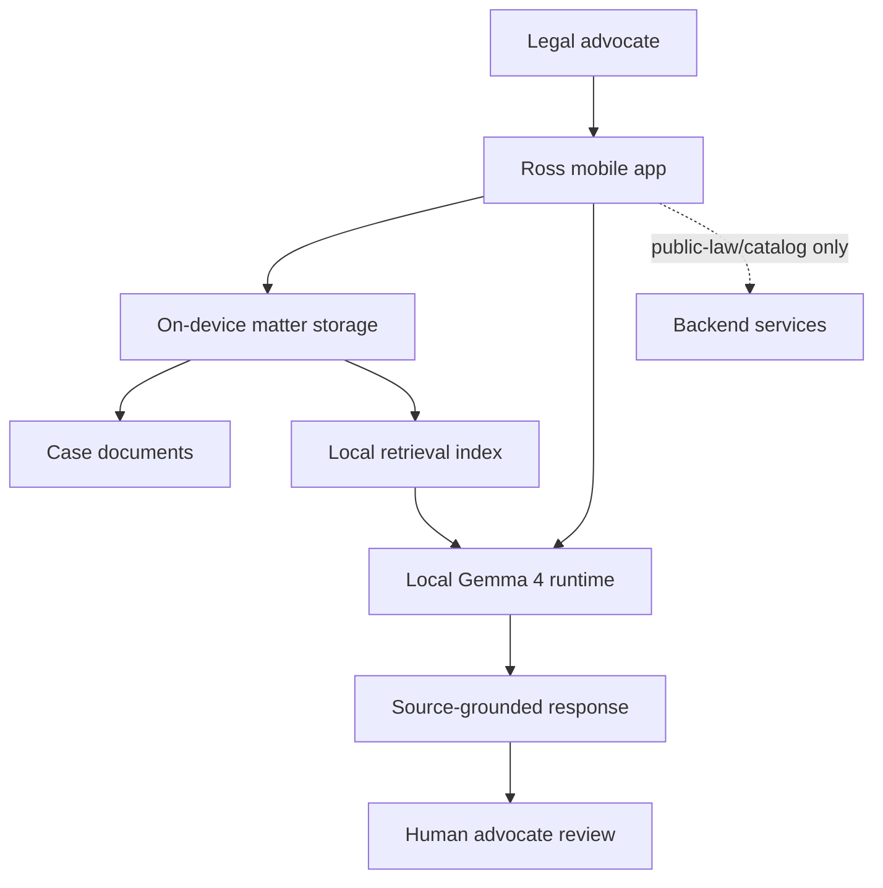

# Ross Gemma4

**A private, local-first AI workbench for access-to-justice legal workflows.**

<p align="center">
  
</p>

<p align="center">
  <a href="./LICENSE"></a>
  
  
  
  
</p>

Ross Gemma4 helps advocates and legal-aid teams turn sensitive case bundles into source-grounded chronologies, issue notes, missing-fact checklists, and first drafts without sending private case documents to a cloud LLM.

<p align="center">
  
  
  
</p>

<p align="center">
  
  
</p>

## What It Does

- **Private case workbench:** import local case files, ask questions, and keep sensitive client material inside the device sandbox.
- **Source-grounded legal assistance:** produce answers, chronologies, and draft notes from retrieved matter snippets instead of unsupported model memory.
- **On-device Gemma 4 runtime:** run quantized GGUF packs through the iOS `llama.cpp` lane, with capability hooks for MLX/CoreAI where the device can support them.
- **Multilingual workflows:** tested app flows include English, Hindi, and Bengali prompts against the synthetic matter bundle.
- **Human-in-the-loop safety:** Ross is a drafting and analysis aid for legal professionals, not an automated decision-maker or replacement for advocate review.

## Current Status

Ross is an active engineering project, not a packaged App Store release. The repo currently includes:

| Area | Status |
| --- | --- |
| iOS app | Local-first Swift app with matter UI, document import paths, Gemma pack selection, GGUF runtime wiring, and physical-device Quick Start smoke proof. |
| Android app | Native Android prototype with matching product direction and debug build plumbing. Runtime validation still needs broader device QA. |
| Backend | Node service for public-law/catalog style support. Private case files are not intended for backend LLM processing. |
| Model packs | Product-visible Quick Start, Case Associate, and Senior Drafting Support tiers mapped to Gemma 4 GGUF artifacts. Large-model release confidence still requires representative-device QA. |
| Documentation | `docs/NEXT_STEP_REPORT.md` tracks the latest checkpoint and proof notes. |

The latest verified local inference checkpoint is the iOS Quick Start GGUF lane on a physical iPhone using the patched `llama.swift` / `llama.cpp` runtime. The 12B and 26B tiers are intentionally treated as higher-risk until full download, storage-pressure, thermal, and representative-device validation is complete.

## Physical iPhone Benchmark

Latest physical-device run: **Aman's iPhone, iPhone 15 Pro / iPhone16,1 / iOS 27.0 / 7 GB RAM**. The current checkout built for device, installed successfully, and ran real local GGUF smoke tests through `com.ross.ios`.

| Pack | Profile | Result | Document/query coverage | Runtime |
| --- | --- | --- | --- | --- |
| Gemma 4 E4B Quick Start, 5.13 GB | quick | PASS | Source-grounded document query plus general query. | `gemma_local_runtime` |
| Gemma 4 E4B Quick Start, 5.13 GB | full | PASS | Source, general, Bengali, Hindi, Tamil, and Telugu queries. | `gemma_local_runtime` |
| Gemma 2 2B baseline, 1.71 GB | quick | PASS | Source-grounded document query plus general query. | Seeded proof pack |
| Gemma 4 12B Case Associate, 7.37 GB | quick | BLOCKED | Generation did not run because the device failed the memory guard. | `insufficient_device_memory` |

Visible speed numbers from the physical iPhone run:

| Run | Stage | Tokens processed | Duration | Token speed |
| --- | --- | ---: | ---: | ---: |
| E4B current app | Source document query | 399 scheduled tokens | 11.91s | 16.12 output tok/s, 33.49 total tok/s |
| E4B current app | General query | 382 scheduled tokens | 8.76s | 21.92 output tok/s, 43.62 total tok/s |
| E4B full | Bengali | 432 scheduled tokens | 12.51s | 15.34 output tok/s |
| E4B full | Hindi | 438 scheduled tokens | 14.77s | 13.00 output tok/s |
| E4B full | Tamil | 445 scheduled tokens | 15.39s | 12.47 output tok/s |
| E4B full | Telugu | 473 scheduled tokens | 20.37s | 9.43 output tok/s |
| 2B baseline | Source document query | 399 scheduled tokens | 6.28s | 30.56 output tok/s |
| 2B baseline | General query | 382 scheduled tokens | 10.58s | 18.15 output tok/s |

The smoke path currently reports prompt tokens, maximum new tokens, and stage duration. `output tok/s` is calculated as `max_new_tokens / stage duration`; `tokens processed` is `prompt_tokens + max_new_tokens`.

| Metric | E4B Quick Start |
| --- | ---: |
| Context window used | 4,096 tokens |
| Max input chars | 22,000 |
| GPU layers | 0 |
| CPU mapped model buffer | 4,873.73 MiB |
| App resident memory after provider ready | ~3.15 GB |
| Peak observed resident memory | ~3.95 GB |
| Device recommended working set | 5,726.63 MB |
| Draft acceleration | Not active: `acceleration=standard`, `draft_tokens=nil` |

Practical device conclusion: **Quick Start E4B works on iPhone 15 Pro-class hardware; Case Associate 12B should stay gated off for this 7 GB device class.**

## Architecture



Private matter documents are designed to stay local. Backend services should be used for public-law metadata, app support, and non-private catalog workflows only.

## Gemma 4 Capability Packs

| Tier | Pack | Base model | Quantization | Approx. size | Intended use |
| --- | --- | --- | --- | --- | --- |
| Quick Start | `gemma-4-e4b-q4` | Gemma 4 E4B | `UD-Q4_K_XL` | ~5.2 GB | Short legal Q&A, intake review, and smaller matters on constrained phones. |
| Case Associate | `gemma-4-12b-q4` | Gemma 4 12B | `UD-Q4_K_XL` | ~7.8 GB | Balanced chronology building, issue extraction, and everyday drafting support. |
| Senior Drafting Support | `gemma-4-26b-a4b-q4` | Gemma 4 26B-A4B | `UD-Q4_K_XL` | ~17.5 GB | Advanced drafting and workstation-class local analysis. |

Downloaded model files are intentionally not committed to this repository. Model artifacts and their usage remain subject to the applicable upstream model license and terms.

## Repository Map

```text
.
├── android/                 # Android prototype
├── backend/                 # Node backend services and tests
├── docs/                    # QA notes, architecture docs, screenshots
├── ios/                     # Swift iOS app, tests, runtime integration
├── scripts/                 # Audit, model, and runtime helper scripts
└── third_party/patches/     # Local patches used to stabilize dependencies
```

## Quick Start

Clone the repo:

```bash
git clone https://github.com/adidshaft/ross-gemma4.git
cd ross-gemma4
```

Run backend checks:

```bash
cd backend
npm install
npm test
```

Run iOS tests:

```bash
swift test --package-path ios
```

Prepare the patched iOS GGUF runtime when validating local inference:

```bash
./scripts/prepare-patched-llama-runtime.sh
```

Build Android debug:

```bash
cd android
./gradlew assembleDebug
```

Some iOS runtime checks require Xcode, a configured signing team, and enough local disk space for multi-GB model artifacts.

## Verification Commands

```bash
./scripts/audit-ross-gemma4-migration.sh
./scripts/verify-model-artifacts.sh --dev
./scripts/audit-ios-runtime.sh
```

For the current project checkpoint, read [`docs/NEXT_STEP_REPORT.md`](docs/NEXT_STEP_REPORT.md).

## Contributing

Contributions are welcome. Start with [`CONTRIBUTING.md`](CONTRIBUTING.md), open focused pull requests, and avoid committing private matter files, generated model artifacts, secrets, or local build outputs.

Good first contribution areas include documentation polish, test coverage, Android validation, accessibility passes, smaller UI fixes, and reproducible device QA notes.

## Responsible Use

Ross is a legal-workflow assistant for professionals and supervised legal-aid teams. It should not be used for fully automated legal decisions, unsupervised legal advice, or direct-to-consumer representation without qualified human review.

All generated outputs require human advocate review. Source citations and retrieval snippets are aids to review, not proof that an output is complete or legally correct.

## License

This repository is licensed under the [MIT License](LICENSE).

Gemma models, datasets, public-law sources, and other third-party artifacts may have separate licenses or terms. Review those terms before downloading, redistributing, or using them in production.
