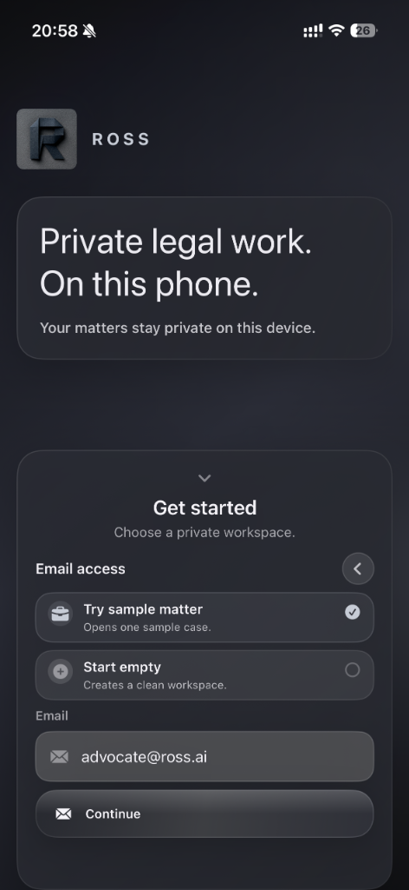
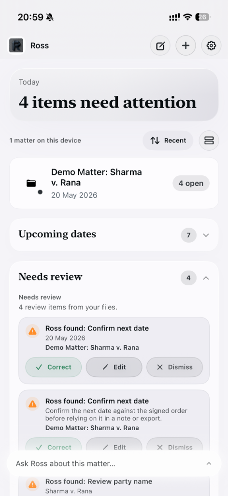
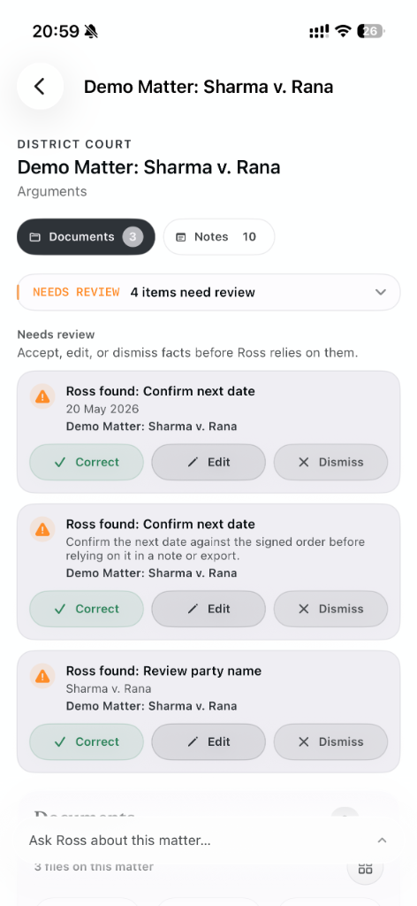
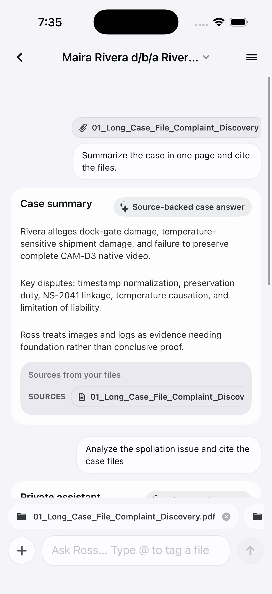
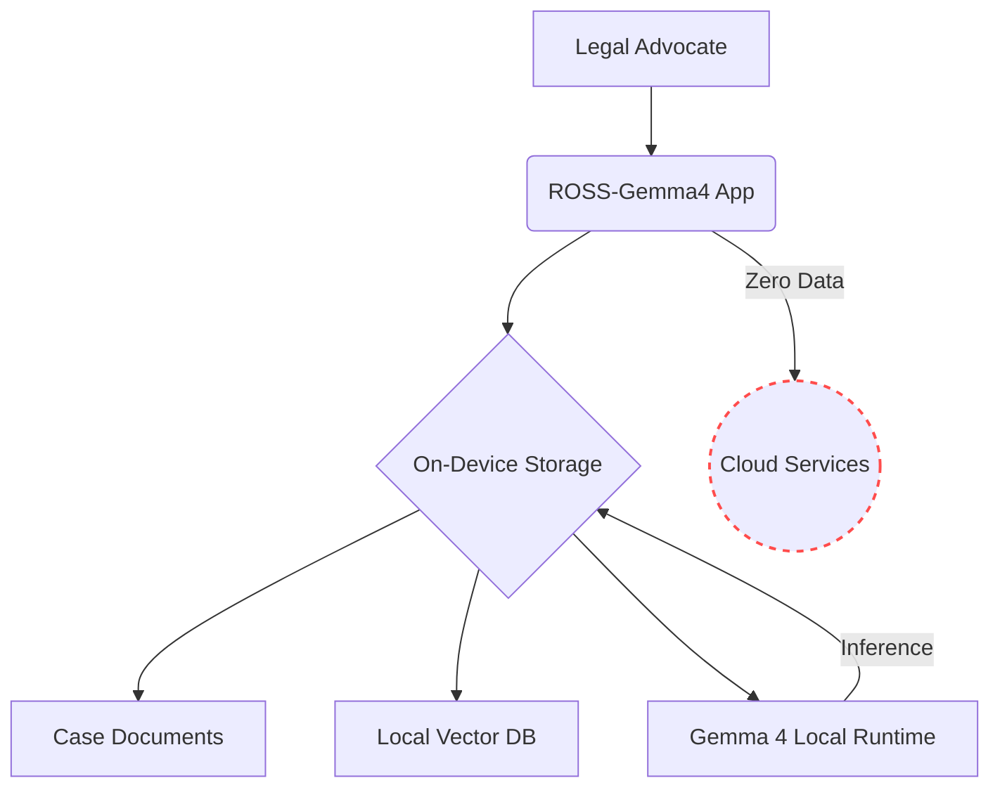
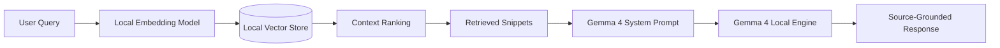

# ROSS-Gemma4

**Private AI Junior Associate for Access-to-Justice Workflows**


ROSS-Gemma4 is a mobile-first, privacy-preserving legal workbench built around Gemma 4. It helps advocates and legal-aid teams turn sensitive case bundles into source-grounded chronologies, issue notes, missing-fact checklists, and first drafts without sending private case documents to a cloud LLM.

[](#)
[](#)
[](#)
[](#)
[](#)

<p align="center">
  
  
  
</p>

<p align="center">
  
</p>

---

## Problem Statement

Access-to-justice legal aid teams are often overwhelmed with large case bundles, disorganized facts, and tight deadlines. While LLMs offer powerful analytical capabilities, traditional cloud-based models are incompatible with the strict privacy requirements of legal workflows. Advocates cannot risk exposing sensitive client data, privileged communications, or unredacted evidence to external servers.

## Solution Overview

ROSS-Gemma4 bridges the gap between advanced AI capabilities and strict legal privacy. By leveraging highly optimized Gemma 4 capability packs on mobile devices, ROSS-Gemma4 acts as a private, local-first junior associate. It reads documents, identifies discrepancies, and drafts chronologies entirely on-device. Your data never leaves the iPad or iPhone.

---

## Demo Workflows

### Synthetic Case Bundle Demo

The repository includes `Ross_Mock_Case_Bundle`, a synthetic six-file civil litigation bundle for **Maira Rivera d/b/a Rivera Instruments v. Northstar Courier, LLC**. It contains pleadings/discovery, a motion hearing transcript, a camera-retention affidavit, exhibit records, and two evidence images. The bundle is designed to show ROSS reading private case files, producing source-backed case answers, flagging timestamp and preservation issues, and separating evidence from inference.

### 1. Intake & Chronology Building
Import a bundle of witness statements and police reports. ROSS-Gemma4 uses the local runtime to cross-reference timestamps, align conflicting accounts, and generate a structured chronology of events, citing the exact source document for every fact.

### 2. Issue Extraction & Missing-Fact Analysis
Ask ROSS-Gemma4 to review a lease agreement against tenant communications. The system will extract key obligations, highlight potential breaches, and automatically generate a checklist of missing facts required to establish a strong defense.

### 3. First-Pass Drafting
Highlight key facts from the chronology and instruct ROSS-Gemma4 to draft a preliminary case summary or a formal notice. The model grounds its draft exclusively in the selected evidence, reducing hallucination risk while accelerating the drafting process.

---

## Gemma 4 Capability Packs

ROSS-Gemma4 utilizes real, quantized Gemma 4 GGUF models directly on-device. We leverage open, publicly accessible weights provided by the community (via HuggingFace's `bartowski` repository) using the `Q4_K_M` 4-bit quantization to balance high-quality reasoning with memory constraints.

There are four Gemma 4 capability packs available for download inside the app:

| Tier | Pack | Base Model | Quantization | Size | Use Case | Target Device |
| --- | --- | --- | --- | --- | --- | --- |
| **Flash Setup** | `gemma-4-e2b-q2` | Gemma 4 E2B | `Q2_K` | ~1.6 GB | Ultra-fast flash setup, immediate short answers, basic review. | Ultra-Constrained Phones |
| **Quick Associate** | `gemma-4-e2b-q4` | Gemma 4 E2B | `Q4_K_M` | ~3.5 GB | Instant setup, intake, short summaries, simple checklists. | Constrained Phones |
| **Case Associate** | `gemma-4-e4b-q4` | Gemma 4 E4B | `Q4_K_M` | ~5.4 GB | Chronology building, issue extraction, missing-fact analysis. | Modern Phones/Tablets |
| **Senior Drafting Support**| `gemma-4-26b-a4b-q4` | Gemma 4 26B-A4B (MoE) | `Q4_K_M` | ~17.0 GB | Advanced drafting, clinic workstation mode, complex cross-referencing. | High-End Local Workstations |

---

## Privacy Architecture

ROSS-Gemma4 enforces a strict perimeter around user data. Case files and inferences are maintained within the device sandbox. There is absolutely no cloud LLM for private case files.



## RAG Pipeline

Our source-grounded RAG implementation relies on precise grounding. Answers are formulated strictly based on the retrieved snippets.



---

## iOS Runtime Status & Inference

The iOS project integrates directly with a functioning `llama.cpp` wrapper (`AlphaLlamaCppEngine`). It successfully executes real on-device inference using Metal acceleration. The fatal errors regarding C-pointer nil unwrapping have been resolved, and models allocate correctly.

## Model Artifact Status

Model downloads are mapped to real, functioning Gemma 4 GGUF URLs hosted on HuggingFace (`bartowski/google_gemma-4-*`). The app handles background downloading natively, calculates real-time ETA, and dynamically loads the weights into the local inference engine.

## Model Download and Verification

Once real artifacts are provided, model artifacts are downloaded securely through verified channels. To guarantee integrity and prevent supply chain attacks, ROSS-Gemma4 conducts SHA-256 checksum verification before authorizing the model for inference. Downloads support resuming if interrupted by network loss.

---

## Legal Safety Boundaries

ROSS-Gemma4 is a workbench, not a practitioner. It adheres to the following safety boundaries:
- **Human Advocate Review**: Every output requires explicit human advocate review.
- **Source-Grounded Priority**: The engine is instructed to refuse questions if the answer cannot be found in the provided case bundle.
- **No Direct-to-Consumer Representation**: The system is explicitly configured to support legal professionals.

---

## 90-Second Demo Script

1. **Setup (0:00-0:15)**: Open ROSS-Gemma4. Navigate to Settings -> Assistant. Tap "Install Quick Associate" to download the real Gemma 4 E2B Q4_K_M capability pack.
2. **Import (0:15-0:30)**: Create a new matter "State v. Doe". Import three sample PDF statements into the case folder.
3. **Analyze (0:30-0:60)**: Tap "Ask ROSS". Ask, "What are the timeline discrepancies between Witness A and Witness B?" The app retrieves context and generates a local response in seconds.
4. **Draft (0:60-1:30)**: Select the highlighted discrepancies and tap "Draft Memo". ROSS-Gemma4 writes a formal memo detailing the contradictions. Tap "Save to Case Files".

---

## Setup and Run Instructions

1. Install [Xcode 16+](https://developer.apple.com/xcode/).
2. Open `ios/Ross.xcodeproj`.
3. Resolve Swift Packages (this step successfully resolves the iOS runtime abstraction).
4. Select your target device or simulator.
5. Build and run `CMD+R`.
6. For demo setup, navigate to Settings and download your preferred Gemma 4 capability pack (Demo Mode).

## Audit and Test Commands

To verify the repository's integrity and artifact constraints, run:
```bash
./scripts/audit-ross-gemma4-migration.sh
./scripts/verify-model-artifacts.sh --dev
./scripts/audit-ios-runtime.sh
```

## Hackathon Relevance

ROSS-Gemma4 exemplifies how high-capability, open-weight models like Gemma 4 can be deployed in highly constrained, privacy-sensitive environments. By bringing Gemma 4 directly to the mobile device, we empower legal professionals with state-of-the-art AI without violating client trust.

## Limitations

- Heavy models (like the 26B-A4B tier) require significant RAM and may throttle or crash on older iOS devices. Devices with 16GB+ Unified Memory are highly recommended for the Senior Drafting tier.
- Generation speed is dependent on Apple Silicon GPU performance and thermal throttling.

## Roadmap

- Integration of a verified Swift inference runtime.
- Provisioning of verified Q4 GGUF URLs.
- Expanded capability packs leveraging future Gemma iterations.
- Collaborative workspace synchronization with end-to-end encryption.
- Seamless macOS desktop application integration.

---

## License & Responsible Use

ROSS-Gemma4 is provided under a custom responsible-use license. You are prohibited from using this software for fully automated decision making in the legal domain. Human review is strictly required for all generated outputs.

Models downloaded through the application are subject to the [Gemma License](https://ai.google.dev/gemma/terms).
