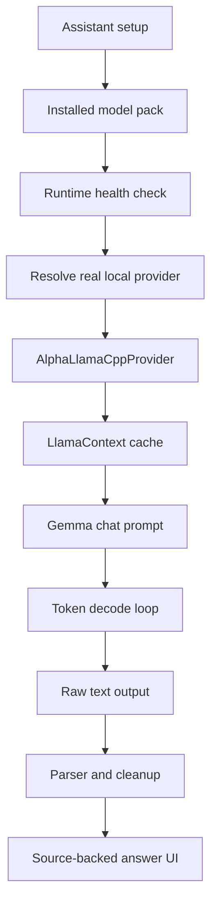
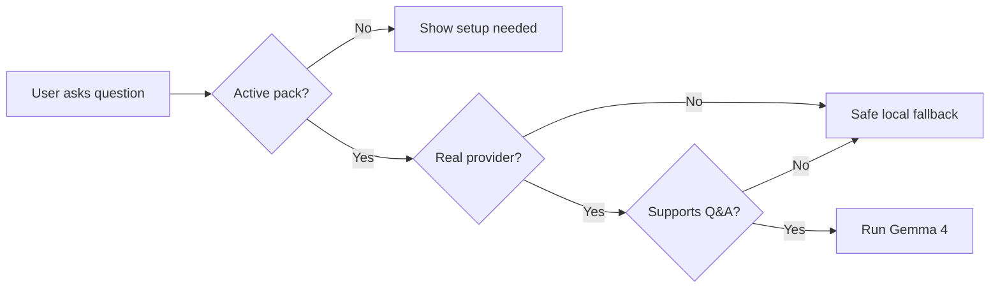
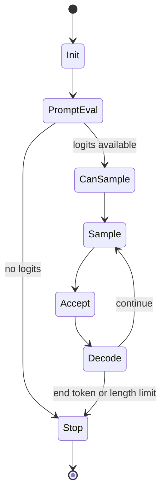
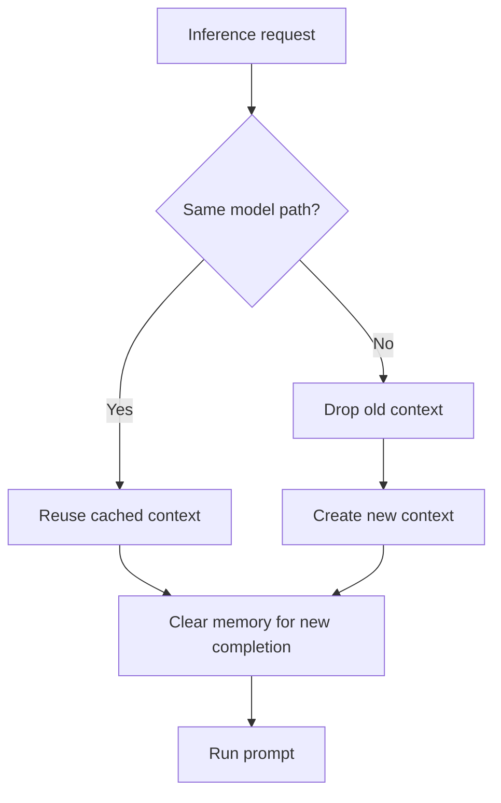
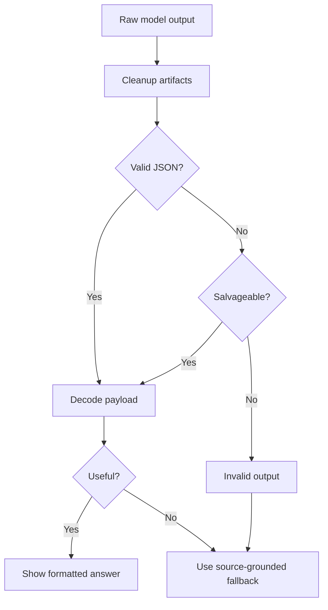
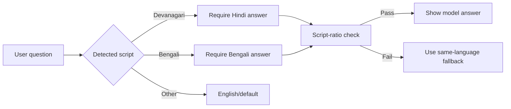
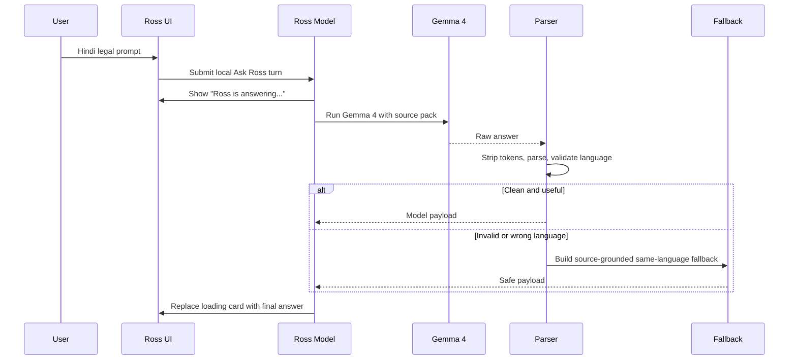

# Making Gemma 4 Actually Work on iOS

This article explains the practical problems we hit while making Gemma 4 run inside the Ross iOS app, and how the final implementation made the model download, load, run, and answer from matter files.

The short version: the issue was not one single bug. It was a stack of iOS runtime, model lifecycle, prompt-format, parser, and UX problems. Each layer could make the product look broken even when another layer was technically working.

## The Symptom

At different points, the app could appear to do one of these things:

- Hang on assistant setup.
- Download or activate a model but not actually use it.
- Show a placeholder answer instead of a real local answer.
- Crash inside llama.cpp with a logits assertion.
- Print raw JSON-like text into the chat UI.
- Leak Gemma chat-template tokens into the response.
- Answer Hindi prompts with mixed Hindi and English.
- Show "private assistant could not answer" even though local sources existed.

The final product needed to satisfy a stricter bar:

1. The assistant setup screen must not hang.
2. The selected Gemma 4 pack must activate.
3. Ask Ross must run the real local model.
4. The UI must show that Gemma 4 is running.
5. The final answer must replace the loading state.
6. The answer must be clean, source-backed, copyable, and language-appropriate.

## Final iOS Runtime Shape



The key runtime files are:

- `ios/Ross/AlphaFoundation/AlphaPrivateAIViews.swift`
- `ios/Ross/AlphaFoundation/AlphaRossModel+PrivateAI.swift`
- `ios/Ross/AlphaFoundation/AlphaLocalModelRuntime.swift`
- `ios/Ross/AlphaFoundation/AlphaLlamaCppProvider.swift`
- `ios/Ross/AlphaFoundation/AlphaLlamaCppEngine.swift`
- `ios/Ross/AlphaFoundation/AlphaRossModel+Ask.swift`

## Problem 1: Setup Looked Like It Hung

Assistant setup can be expensive because a model pack is large and the app must verify local state, storage, active tier, and runtime availability. If the UI blocks during that path, the user experiences it as a hang.

The fix was to make setup state explicit:

- Show each assistant tier as an installable option.
- Activate the selected pack.
- Show `Ross assistant is ready` only when runtime health says it can answer.
- Keep setup and diagnostics separated so the user is not forced to understand runtime internals.

The app now shows storage usage and readiness in settings. In the simulator run, the Flash pack activated and the storage row moved from zero to about 3 GB, proving that the pack was installed into app storage.

## Problem 2: "Downloaded" Did Not Guarantee "Used"

A downloaded model file is only useful if the answer path resolves a real provider and routes the question through it. Ross therefore checks:

- Is there an active pack?
- Is the runtime mode real, not deterministic development?
- Does the provider support `matterQuestionAnswer`?
- Is the model path present?
- Does runtime health say the model is available?



This is why the loading card matters. It says `Gemma 4 E2B Q2_K is running on this iPhone`, which is a product-level proof that the real runtime path is active.

## Problem 3: llama.cpp Crashed on Missing Logits

One major failure was a llama.cpp assertion around missing logits. In practice, this can happen when the runtime tries to sample before a decodable logits state exists, or when context state from a previous completion contaminates the next run.

The fix in `AlphaLlamaCppEngine.swift` was to treat the completion loop as a strict state machine.



Important implementation details:

- Clear llama memory before each completion.
- Reset the sampler per completion.
- Track whether logits are actually decodable.
- Only sample when prompt evaluation created logits.
- Call `llama_sampler_accept(...)` after sampling.
- Stop gracefully if logits are not available.

This changed the failure mode from "crash" to "safe empty/invalid output that Ross can handle."

## Problem 4: Context Reuse Needed Discipline

Creating a llama context is expensive. Reusing the context is good for performance, but it must be done carefully.

Ross caches the context by model path:



The nuance is that context reuse and conversation reuse are not the same thing. We reuse the loaded model context for speed, but we clear inference memory per request so the next answer does not inherit stale prompt state.

## Problem 5: Chat Template Tokens Leaked

Gemma-style chat prompts use turn markers. If those markers are inserted incorrectly, parsed incorrectly, or generated back by the model, the UI can show artifacts such as start/end turn fragments.

Ross fixed this at two layers:

1. Prompt construction avoids literal fake tokens such as raw `<bos>` strings.
2. Output cleanup strips turn marker fragments if the model emits them.

The tokenizer is also configured to parse special tokens so the runtime and model agree on prompt boundaries.

## Problem 6: Raw JSON Showed Up in Chat

Earlier responses sometimes looked like:

```text
json{headline...
```

That happened because small local models may partially follow a JSON instruction but produce malformed structured text. The UI should never display that raw text.

The fix was to make the parser more forgiving while making the UI stricter:

- Strip think tags.
- Strip Gemma turn markers.
- Salvage JSON-prefixed loose objects.
- Salvage common malformed headline/sections fragments.
- Fail closed for structured junk.
- Display only clean headline and section strings.



This is one of the most important product lessons: local model output needs a cleanup and validation layer even when the model is good.

## Problem 7: The Answer Was Too Generic

For legal work, a generic answer is often worse than no answer. Ross added usefulness checks for source-specific terms. For the mock case, useful answers should mention facts such as:

- CAM-D3.
- Asha Menon.
- Fourteen-day retention.
- Video export queue failure.
- Overlay timestamp lag.
- Automated overwrites.
- Native video unavailable by a specific date.

If the model output does not include concrete source facts, Ross falls back to deterministic source-grounded text generated from the source pack.

That fallback lives in `sourceGroundedMatterAskFallback(...)`.

## Problem 8: Hindi Prompts Produced Hinglish

Small local models often mix scripts: a Hindi question may produce an answer that uses Hindi grammar with English technical/legal words. For Ross, the requested behavior was stricter: if the advocate asks in Hindi, answer in Hindi only.

The final solution has three parts:

1. The prompt explicitly says to answer only in natural Hindi using Devanagari script.
2. Ross detects requested language by Unicode script range, not fragile regex names.
3. Ross rejects model payloads that do not match the requested script ratio.



The relevant functions are:

- `alphaAnswerLanguage(for:)`
- `alphaPayloadMatchesRequestedLanguage(...)`
- `alphaIndicScriptRatio(...)`
- `alphaLatinWordCount(...)`

This is why the final simulator run could answer a Hindi translation/summarization prompt in Hindi-only text instead of Hinglish.

The same pattern extends to Bengali. Ross detects Bengali script, asks Gemma 4 to answer in Bengali, and validates that the final payload is not an English/Hinglish mix before replacing the loading state.

<p align="center">
  
  
</p>

This matters because multilingual support is a legal-workflow requirement, especially in India. The Government of India recognizes 22 scheduled languages, while Census language data tracks much broader language diversity. A useful private legal assistant cannot assume that the lawyer's query, the client's facts, and the court record are all in the same language.

| Layer | Implementation |
| --- | --- |
| Prompt | Explicitly asks Gemma 4 to match the advocate's language and script. |
| Detection | Uses Unicode script ranges for Devanagari and Bengali rather than brittle language names. |
| Validation | Rejects model output when the requested script ratio is too low. |
| Fallback | Generates source-grounded fallback text in the requested language when the model output is mixed or weak. |
| Product proof | Simulator screenshots show Hindi and Bengali prompts answered from local matter files with source pills. |

Officially, the Gemma 4 model card reports 35+ out-of-the-box languages and 140+ pre-training language coverage. It does not publish a complete public list of all 140+ language names, so the product documentation links to the model card and keeps its own QA matrix for tested languages.

## Problem 9: Invalid Model Output Hid Valid Local Sources

During live simulator testing, Gemma 4 ran, but the output was invalid for one Hindi translation prompt. The app initially showed:

```text
Private assistant could not answer
```

That was technically honest, but product-wise too brittle. The user had local sources. Ross should still provide a source-grounded fallback rather than dead-end the interaction.

The fix was to allow a generic local fallback when:

- Gemma ran.
- The model output was unusable.
- Local matter/source text exists.
- The user asked in a supported language.

This produced a clean Hindi answer from local matter details while preserving the `Private assistant` status and source pills.

## Problem 10: Token Decoding Used Deprecated C String Paths

The llama token loop originally used deprecated C string initializers. That was not the core product bug, but it created Xcode warnings and made UTF-8 handling less explicit.

The fix converts token pieces through bytes:

```swift
private func decodeTokenBytes(_ cchars: [CChar], repairingInvalidUTF8: Bool) -> String? {
    let bytes = cchars.map { UInt8(bitPattern: $0) }
    if repairingInvalidUTF8 {
        return String(decoding: bytes, as: UTF8.self)
    }
    return String(bytes: bytes, encoding: .utf8)
}
```

This keeps token assembly explicit and removed the build warnings from the simulator build.

## Final Runtime Behavior



## Verification

The final implementation was verified with:

- Unit tests for parser cleanup.
- Unit tests for Hinglish rejection.
- Unit tests for Hindi source-grounded fallback.
- Unit tests for generic local fallback when model output is invalid.
- Swift package tests: 73 tests, 0 failures.
- Xcode simulator build and run.
- Live simulator prompt showing `Gemma 4 E2B Q2_K is running on this iPhone`.
- Live Hindi response in Devanagari with source pills.

The successful simulator evidence is stored at:

```text
artifacts/simulator-screenshots/62-hindi-translation-source-grounded.jpg
```

## Implementation Checklist

For another team implementing Gemma 4 on iOS, this is the checklist I would use:

1. Do not start with chat UI. Start with runtime health and model path verification.
2. Keep model download, activation, and runtime resolution separate.
3. Cache the model context, but clear inference memory per completion.
4. Never sample unless prompt evaluation produced decodable logits.
5. Accept sampled tokens into the sampler.
6. Avoid fake BOS strings; let the tokenizer handle special tokens.
7. Strip generated chat-template fragments from output.
8. Treat raw model output as untrusted.
9. Add a parser, a quality gate, and a source-grounded fallback.
10. Test multilingual prompts with script checks, not just semantic checks.
11. Show a loading state that proves the real local runtime is running.
12. Test the actual simulator or device path, not only mocks.

## The Main Lesson

The hard part of local Gemma 4 on iOS is not only inference. The hard part is productizing inference.

You need a model lifecycle, runtime contract, prompt discipline, parser, validation layer, source-grounded fallback, language policy, and honest UI. Once all of those pieces are in place, Gemma 4 can work as a real on-device assistant instead of a fragile demo.

## References

- [Gemma 4 model card](https://ai.google.dev/gemma/docs/core/model_card_4)
- [Government of India: Constitutional provisions for languages](https://www.education.gov.in/en/constitutional-provision-1)
- [Census of India C-16 mother tongue table](https://censusindia.gov.in/nada/index.php/catalog/10191)
