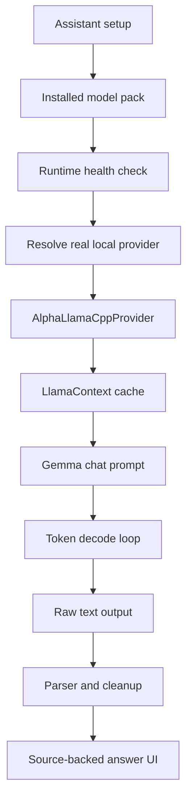
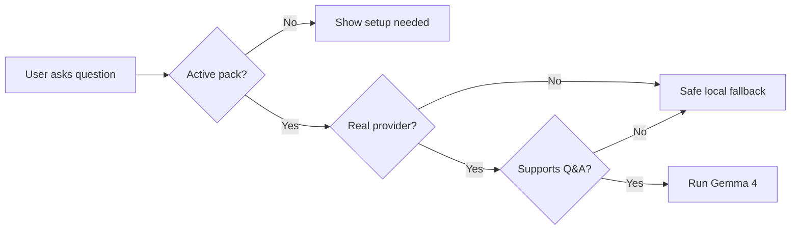
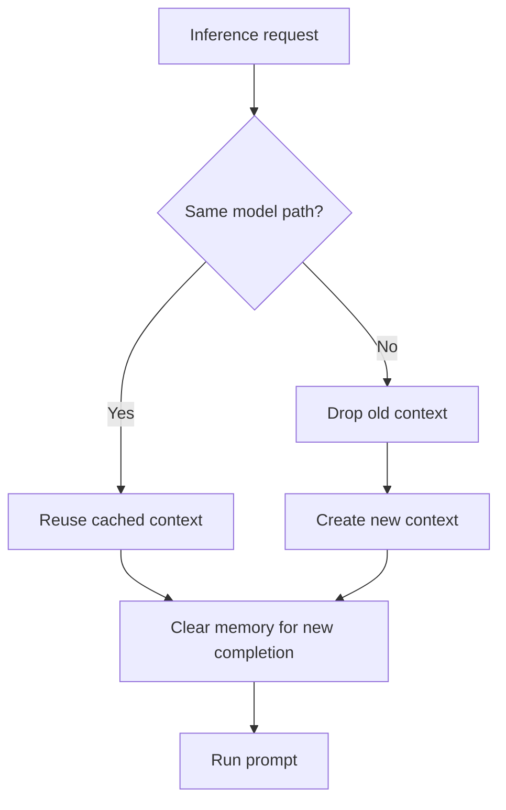
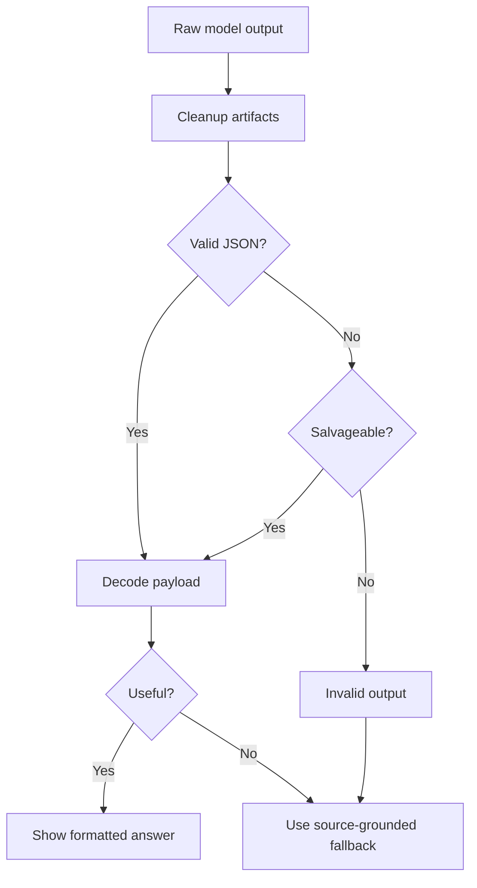
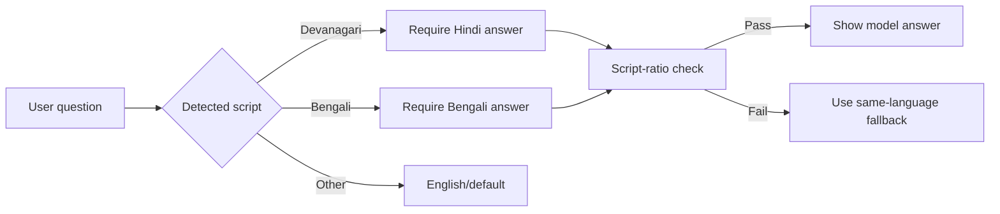
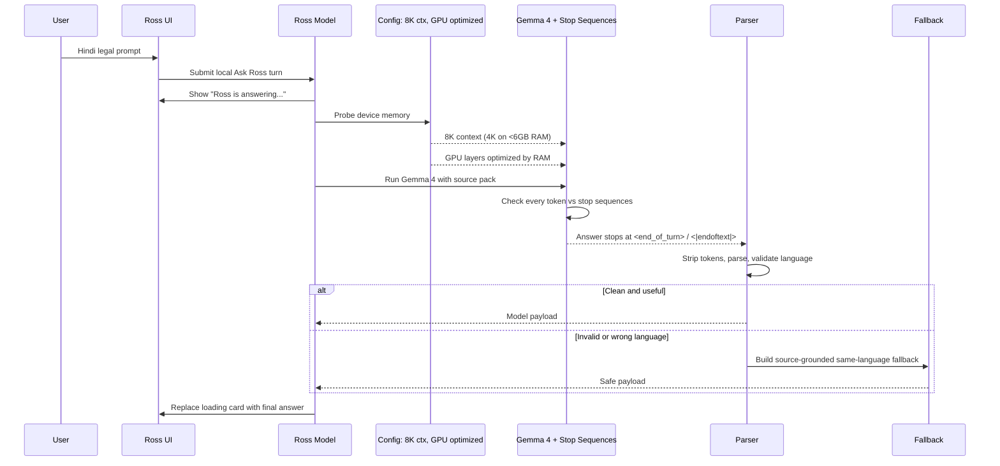
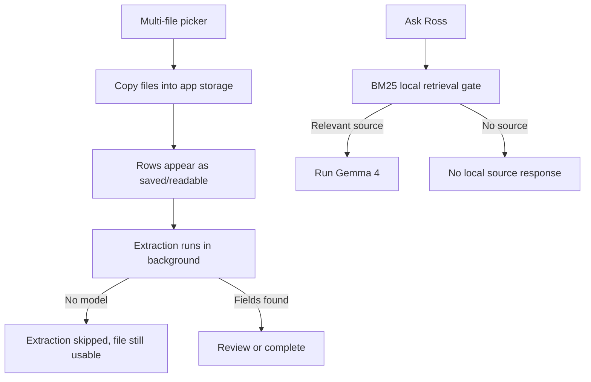

# Making Gemma 4 Actually Work on iOS

This article explains the practical problems we hit while making Gemma 4 run inside the Ross iOS app, and how the final implementation made the model download, load, run, and answer from matter files.

The short version: the issue was not one single bug. It was a stack of iOS runtime, model lifecycle, prompt-format, parser, and UX problems. Each layer could make the product look broken even when another layer was technically working.

## The Symptom

At different points, the app could appear to do one of these things:

- Hang on assistant setup.
- Download or activate a model but not actually use it.
- Show a placeholder answer instead of a real local answer.
- Crash inside llama.cpp with a logits assertion.
- Print raw JSON-like text into the chat UI.
- Leak Gemma chat-template tokens into the response.
- Answer Hindi prompts with mixed Hindi and English.
- Show "private assistant could not answer" even though local sources existed.
- Default first-run setup to a large pack that made onboarding feel stuck.
- Run Gemma 4 successfully but hide the completed answer on the matter screen.
- Show two separate "Ross is answering" loading surfaces for one local query.

The final product needed to satisfy a stricter bar:

1. The assistant setup screen must not hang.
2. The selected Gemma 4 pack must activate.
3. Ask Ross must run the real local model.
4. The UI must show that Gemma 4 is running.
5. The final answer must replace the loading state.
6. The answer must be clean, source-backed, copyable, and language-appropriate.
7. Fresh onboarding must choose the fastest real model path by default.

## Final iOS Runtime Shape



The key runtime files are:

- `ios/Ross/AlphaFoundation/AlphaPrivateAIViews.swift`
- `ios/Ross/AlphaFoundation/AlphaRossModel+PrivateAI.swift`
- `ios/Ross/AlphaFoundation/AlphaLocalModelRuntime.swift`
- `ios/Ross/AlphaFoundation/AlphaLlamaCppProvider.swift`
- `ios/Ross/AlphaFoundation/AlphaLlamaCppEngine.swift`
- `ios/Ross/AlphaFoundation/AlphaRossModel+Ask.swift`

## Problem 1: Setup Looked Like It Hung

Assistant setup can be expensive because a model pack is large and the app must verify local state, storage, active tier, and runtime availability. If the UI blocks during that path, the user experiences it as a hang.

The fix had three parts.

First, setup state became explicit:

- Show each assistant tier as an installable option.
- Activate the selected pack.
- Show `Ross assistant is ready` only when runtime health says it can answer.
- Keep setup and diagnostics separated so the user is not forced to understand runtime internals.

Second, downloads moved away from a background `URLSessionDownloadTask` path that produced `NSURLErrorDomain -1` in simulator and device-style runs. Ross now uses a normal `URLSessionConfiguration.default` download path for setup, with connectivity waiting and large-transfer options configured. That made the download/verify path deterministic enough for foreground assistant setup.

Third, progress publishing was throttled. The app had been updating observable setup state too often, which made SwiftUI recompute heavily enough that the screen felt frozen. Ross now publishes progress only after meaningful byte deltas or a short time interval, and setup progress is no longer mirrored into the persistent Ask dock.

The app now shows storage usage and readiness in settings. In the simulator run, the Flash pack activated and the storage row moved to about 3 GB, proving that the real GGUF pack was installed into app storage.

## Problem 1.5: First-Run Picked the Wrong Pack

On a powerful simulator host, the recommendation heuristic could select a larger pack such as Full. That was technically rational from a memory/storage perspective, but wrong for onboarding. A first install should prove the assistant works quickly before asking the user to wait for heavier downloads.

The fix was to separate first-run setup from advanced pack selection:

- Onboarding displays Flash as the recommended default.
- The header size label follows the displayed selection, so it says `3.0 GB` for Flash.
- Larger packs remain visible and selectable.
- Settings can still activate heavier packs later.

This changed onboarding from "maybe start a 17 GB setup" to "start with a reliable 3 GB assistant, then upgrade if needed."

## Problem 2: "Downloaded" Did Not Guarantee "Used"

A downloaded model file is only useful if the answer path resolves a real provider and routes the question through it. Ross therefore checks:

- Is there an active pack?
- Is the runtime mode real, not deterministic development?
- Does the provider support `matterQuestionAnswer`?
- Is the model path present?
- Does runtime health say the model is available?



This is why the loading card matters. It says `Gemma 4 E2B Q2_K is running on this iPhone`, which is a product-level proof that the real runtime path is active.

The runtime health check also verifies that the model path points to a real, non-empty file. A stale active pack record is not enough. The app must be able to resolve the installed GGUF path and see a usable artifact before it presents the assistant as ready.

## Problem 3: llama.cpp Crashed on Missing Logits

One major failure was a llama.cpp assertion around missing logits. In practice, this can happen when the runtime tries to sample before a decodable logits state exists, when context state from a previous completion contaminates the next run, or when GPU offloading on a low-RAM device causes OOM.

The fix in `AlphaLlamaCppEngine.swift` was to treat the completion loop as a strict state machine and configure memory/compute based on device constraints.

```mermaid
stateDiagram-v2
    [*] --> ProbeMemory
    ProbeMemory --> CheckRAM: Device RAM < 6GB?
    CheckRAM -->|Yes| Config4K: Context 4096 + 0 GPU layers
    CheckRAM -->|6-10GB| Config4K_GPU: Context 8192 + 24 GPU layers
    CheckRAM -->|No| Config8K_GPU: Context 8192 + 99 GPU layers
    Config4K --> Init
    Config4K_GPU --> Init
    Config8K_GPU --> Init
    Init --> PromptEval
    PromptEval --> CanSample: logits available
    PromptEval --> Stop: no logits
    CanSample --> Sample
    Sample --> Accept
    Accept --> Decode
    Decode --> StopCheck{Stop sequence<br/>or end token?}
    StopCheck -->|Yes| Stop
    StopCheck -->|No| Decode
    Stop --> [*]
```

Important implementation details:

- **Dynamic context window**: 4096 tokens on RAM <6GB, 8192 on standard devices.
- **Dynamic GPU layers**: 0 on <6GB RAM, 24 on 6–10GB, 99 on ≥10GB.
- **Explicit stop sequences**: Inference checks for `<end_of_turn>`, `<start_of_turn>`, `<|endoftext|>`, `\nQuestion:`, etc. to prevent template leakage.
- Clear llama memory before each completion.
- Reset the sampler per completion.
- Track whether logits are actually decodable.
- Only sample when prompt evaluation created logits.
- Call `llama_sampler_accept(...)` after sampling.
- Stop gracefully if logits are not available.

This changed the failure mode from "crash or OOM" to "safe response with predictable resource usage."

## Problem 4: Context Reuse Needed Discipline

Creating a llama context is expensive. Reusing the context is good for performance, but it must be done carefully.

Ross caches the context by model path:



The nuance is that context reuse and conversation reuse are not the same thing. We reuse the loaded model context for speed, but we clear inference memory per request so the next answer does not inherit stale prompt state.

## Problem 5: Chat Template Tokens Leaked

Gemma-style chat prompts use turn markers. If those markers are inserted incorrectly, parsed incorrectly, or generated back by the model, the UI can show artifacts such as start/end turn fragments.

Ross fixed this at three layers:

1. **Prompt construction** avoids literal fake tokens such as raw `<bos>` strings. The prompt builder in `AlphaLlamaCppProvider.conciseMatterQuestionPrompt()` explicitly constructs the chat template.
2. **Inference-time stop sequences** enforce hard stops at `<end_of_turn>`, `<start_of_turn>`, `<|endoftext|>`, `\nQuestion:`, etc. The `shouldStopGeneration()` function checks every token against these stops, preventing multi-turn leakage at generation time.
3. **Output cleanup** strips remaining turn marker fragments if the model emits them despite stop enforcement. The `stripTurnMarkerFragments()` function uses regex to clean any leftover fragments.

The tokenizer is also configured to parse special tokens so the runtime and model agree on prompt boundaries.

## Problem 6: Raw JSON Showed Up in Chat

Earlier responses sometimes looked like:

```text
json{headline...
```

That happened because small local models may partially follow a JSON instruction but produce malformed structured text. The UI should never display that raw text.

The fix was to make the parser more forgiving while making the UI stricter:

- Strip think tags.
- Strip Gemma turn markers.
- Salvage JSON-prefixed loose objects.
- Salvage common malformed headline/sections fragments.
- Fail closed for structured junk.
- Display only clean headline and section strings.



This is one of the most important product lessons: local model output needs a cleanup and validation layer even when the model is good.

The parser also handles plain text that looks like a model tried to follow a structured schema but missed punctuation, for example `Heading : ...` followed by loose bullet fragments. Ross normalizes those into a headline and readable sections rather than printing parser-shaped text into the UI.

## Problem 7: The Answer Was Too Generic

For legal work, a generic answer is often worse than no answer. Ross added usefulness checks for source-specific terms. For the mock case, useful answers should mention facts such as:

- CAM-D3.
- Asha Menon.
- Fourteen-day retention.
- Video export queue failure.
- Overlay timestamp lag.
- Automated overwrites.
- Native video unavailable by a specific date.

If the model output does not include concrete source facts, Ross falls back to deterministic source-grounded text generated from the source pack.

That fallback lives in `sourceGroundedMatterAskFallback(...)`.

## Problem 8: Hindi Prompts Produced Hinglish

Small local models often mix scripts: a Hindi question may produce an answer that uses Hindi grammar with English technical/legal words. For Ross, the requested behavior was stricter: if the advocate asks in Hindi, answer in Hindi only.

The final solution has three parts:

1. The prompt explicitly says to answer only in natural Hindi using Devanagari script.
2. Ross detects requested language by Unicode script range, not fragile regex names.
3. Ross rejects model payloads that do not match the requested script ratio.



The relevant functions are:

- `alphaAnswerLanguage(for:)`
- `alphaPayloadMatchesRequestedLanguage(...)`
- `alphaIndicScriptRatio(...)`
- `alphaLatinWordCount(...)`

This is why the final simulator run could answer a Hindi translation/summarization prompt in Hindi-only text instead of Hinglish.

## Problem 9: Invalid Model Output Hid Valid Local Sources

During live simulator testing, Gemma 4 ran, but the output was invalid for one Hindi translation prompt. The app initially showed:

```text
Private assistant could not answer
```

That was technically honest, but product-wise too brittle. The user had local sources. Ross should still provide a source-grounded fallback rather than dead-end the interaction.

The fix was to allow a generic local fallback when:

- Gemma ran.
- The model output was unusable.
- Local matter/source text exists.
- The user asked in a supported language.

This produced a clean Hindi answer from local matter details while preserving the `Private assistant` status and source pills.

## Problem 9.5: A Real Answer Was Generated but Not Shown

One of the most frustrating bugs in the final simulator pass was not a model bug. Gemma 4 ran, CPU returned to idle, and the logs showed llama.cpp completion. But the matter screen still looked unchanged because `AlphaCaseWorkspaceScreen` had disabled inline response cards:

```swift
AlphaRootAskDock(
    model: model,
    fixedScopeCaseID: caseId,
    showsInlineResponseCard: false
)
```

That made the app feel as if the assistant had failed even though the real local model path had completed. The fix was simply to let the matter workspace show inline results:

```swift
showsInlineResponseCard: true
```

This is a useful lesson for on-device AI products: "model ran" is not the same as "feature worked." The generated answer must land in the exact user flow that started the request.

## Problem 9.6: Duplicate Loading States Made the App Feel Noisy

Quick Ask Ross originally showed two pending states at once:

- A slim dock activity bar.
- A full response card saying `Ross is answering...`.

Both were technically accurate, but together they made the UI feel confused and heavier than it was. The final behavior keeps the full pending answer card for local inference and removes the duplicate activity bar for the same local turn. The user sees one clear loading state, then the final answer.

## Problem 10: Token Decoding Used Deprecated C String Paths

The llama token loop originally used deprecated C string initializers. That was not the core product bug, but it created Xcode warnings and made UTF-8 handling less explicit.

The fix converts token pieces through bytes:

```swift
private func decodeTokenBytes(_ cchars: [CChar], repairingInvalidUTF8: Bool) -> String? {
    let bytes = cchars.map { UInt8(bitPattern: $0) }
    if repairingInvalidUTF8 {
        return String(decoding: bytes, as: UTF8.self)
    }
    return String(bytes: bytes, encoding: .utf8)
}
```

This keeps token assembly explicit and removed the build warnings from the simulator build.

## Final Runtime Behavior



**Key improvements in the final implementation:**
- **Context window is adaptive**: 4096 tokens on low-RAM devices, 8192 on standard devices, supporting longer documents.
- **GPU optimization prevents OOM**: Layer offloading scales with available RAM (0 layers on <6GB, 24 on 6–10GB, 99 on ≥10GB).
- **Stop sequences prevent template leakage**: Six explicit stops checked at every token ensure model output ends cleanly without multi-turn markers.
- **Storage doesn't leak**: Deterministic temp paths, sibling cleanup, and resume-data sweeping ensure re-downloads don't accumulate orphaned files.
- **Startup is fast**: Manifest-based checksums skip expensive SHA-256 hashing; 350ms splash timeout ensures UI is visible quickly; persist() is debounced to 250ms.

## Verification

The current iOS implementation (extending-ross branch) was verified with:

**Startup & Performance**
- Fresh cold launch shows auth landing within 500ms (no white screen).
- Assistant setup completes without hanging or timeout.
- 350ms splash timeout confirmed in `AlphaRootNavigation.swift:71–94`.
- 250ms persist debouncing confirmed in `AlphaRossModel+Documents.swift:972–982`.

**Runtime & Inference**
- Context window dynamically configured: 4096 on low-RAM, 8192 on standard devices (verified in `AlphaLlamaCppEngine.swift:110`).
- GPU layer allocation by RAM: 0 on <6GB, 24 on 6–10GB, 99 on ≥10GB (verified in `AlphaLlamaCppEngine.swift:86–98`).
- Stop sequences enforced: 6 explicit stops checked at every token (verified in `AlphaLlamaCppProvider.swift:305–314`).
- Live simulator prompt showing `Gemma 4 E2B Q2_K is running on this iPhone`.
- Visible inline answers with source pills on the matter screen.
- No `<end_of_turn>` or `<start_of_turn>` leakage in final output.

**Storage & Cleanup**
- Deterministic temp paths (`ross-pending-<tier>`) prevent orphan accumulation (verified in `AlphaRossModel+PrivateAI.swift:537–541`).
- Sibling file pruning after install prevents multi-version storage (verified in `AlphaStore.swift:287, 332`).
- Resume data sweep caps lifetime (verified in `AlphaStore.swift:356–367`).
- Full model-artifacts cleanup implemented (verified in `AlphaStore.swift:369–375`).

**Manifest-Based Checksums**
- SHA-256 skipped on startup; checksum loaded from manifest (verified in `AlphaRossModel+Persistence.swift:233–275`).
- Manifest written after successful download with verified checksum.

The codebase includes targeted parser and language tests for cleanup, Hinglish rejection, Hindi fallback, and invalid-output fallback.

The successful simulator evidence is stored at:

```text
artifacts/simulator-screenshots/88-fresh-onboarding-flash-default.jpg
artifacts/simulator-screenshots/89-fresh-bulk-file-picker-six-selected.jpg
artifacts/simulator-screenshots/90-fresh-six-files-imported-ready.jpg
artifacts/simulator-screenshots/91-fresh-english-real-gemma-inline-answer.jpg
```

## Android Physical-Device Remediation

After the iOS path stabilized, the Android physical-device pass exposed the same class of product issues in a different runtime stack. The app could show an installed assistant but reject the model during `probeAvailability`, import a readable PDF and mark it failed because legal-field extraction needed a model, or show old "drafted from your files" chat turns that were created before source-grounding was strict.

The Android fix mirrors the iOS lesson: model lifecycle, document ingest, retrieval, and UI state have to be independent pieces.



The concrete Android remediation did five things:

1. Runtime probing stopped hard-blocking unknown devices and stopped assuming every local artifact must be a `.task` file.
2. Documents gained separate `fileStatus`, `ocrStatus`, and `extractionStatus` states, so missing model setup no longer appears as "file failed."
3. The stale heuristic chat generator was removed, legacy misleading turns are migrated, and chat now refuses to claim file grounding without retrieval support.
4. Import entry points use multi-document pickers and a batch import path.
5. Matter lists use stable keys and matter creation no longer relies on route changes for refresh.

This is now documented in `docs/REMEDIATION_PLAN.md`, and the app includes a developer-only diagnostics panel under technical diagnostics for validating the five fixes on-device.

## Implementation Checklist

For another team implementing Gemma 4 on iOS, this is the checklist I would use:

**Runtime & Performance**
1. Do not start with chat UI. Start with runtime health and model path verification.
2. Keep model download, activation, and runtime resolution separate.
3. **Configure context window dynamically based on device RAM**: 4096 on <6GB, 8192 on standard devices.
4. **Allocate GPU layers by RAM**: 0 on <6GB, 24 on 6–10GB, 99 on ≥10GB to prevent OOM.
5. Cache the model context, but clear inference memory per completion.
6. Never sample unless prompt evaluation produced decodable logits.
7. Accept sampled tokens into the sampler.
8. **Enforce explicit stop sequences at inference time** (`<end_of_turn>`, `<start_of_turn>`, `<|endoftext|>`, `\nQuestion:`, etc.) to prevent template leakage.

**Startup & Persistence**
9. **Use manifest files for checksums; skip SHA-256 on startup**. Trust the stored checksum from the download manifest.
10. **Debounce persist() calls to 250ms** to prevent state churn and excessive actor queue accumulation.
11. **Decouple splash dismissal from async work**. Dismiss after 350ms or `loadIfNeeded()` completes, whichever is sooner.

**Storage & Cleanup**
12. **Use deterministic temp paths** (`ross-pending-<tier>`) instead of UUID-per-attempt.
13. **Sweep orphaned files on app launch**: temp directory, sibling model packs, stale resume data.
14. **Prune sibling files after install** to prevent multi-version accumulation on re-download.

**Output & Validation**
15. Avoid fake BOS strings; let the tokenizer handle special tokens.
16. Strip generated chat-template fragments from output (fallback to inference-time stops).
17. Treat raw model output as untrusted.
18. Add a parser, a quality gate, and a source-grounded fallback.
19. Test multilingual prompts with script checks, not just semantic checks.

**UX & Product**
20. Show a loading state that proves the real local runtime is running (e.g., "Gemma 4 E2B Q2_K is running on this iPhone").
21. Test the actual simulator or device path, not only mocks.
22. Make first-run setup choose the smallest reliable real pack.
23. Ensure the surface that starts inference also displays the completed answer.
24. Avoid duplicate loading UI for the same model turn.

## The Main Lesson

The hard part of local Gemma 4 on iOS is not only inference. The hard part is productizing inference.

You need a model lifecycle, runtime contract, prompt discipline, parser, validation layer, source-grounded fallback, language policy, and honest UI. Once all of those pieces are in place, Gemma 4 can work as a real on-device assistant instead of a fragile demo.
