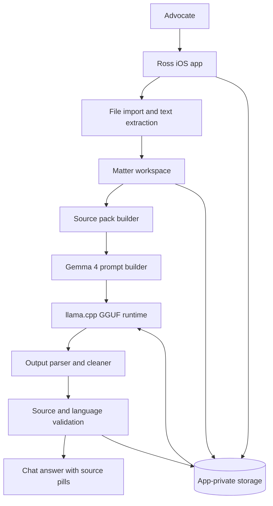
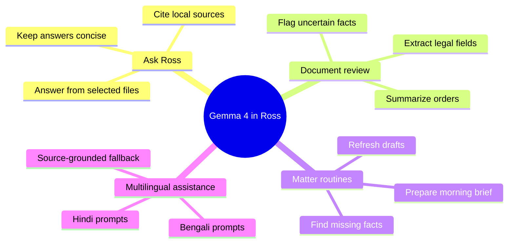
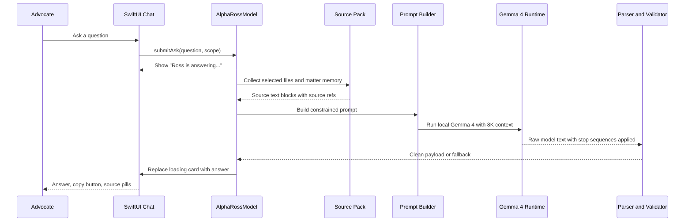
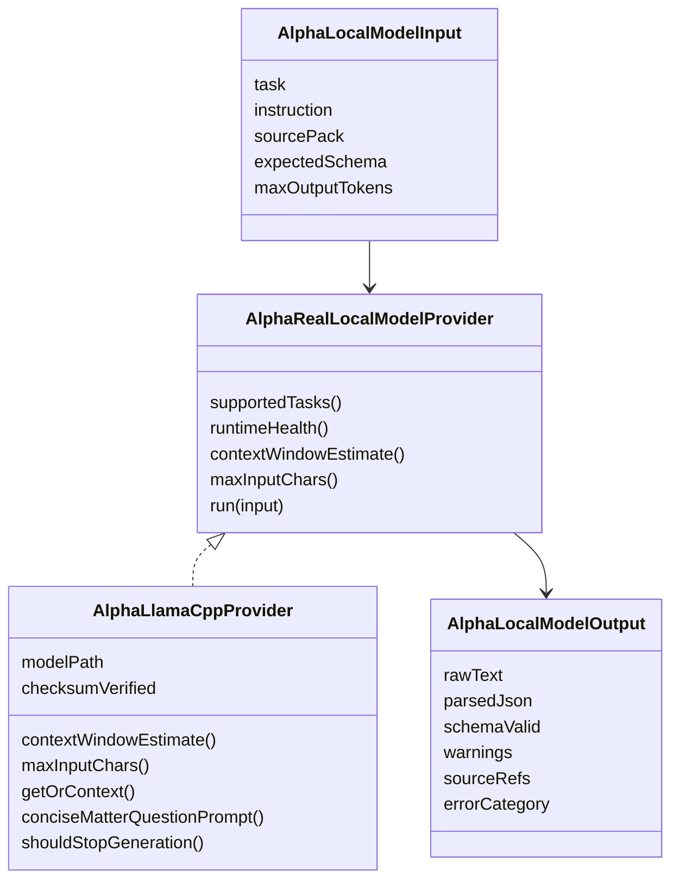
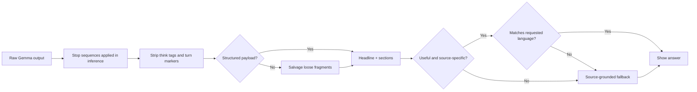

# How Ross Uses Gemma 4 for Private Legal Work

This article explains how Ross uses Gemma 4 as an on-device legal assistant for private matter workflows. It is written as a technical implementation guide: a reader should be able to understand the product architecture, reproduce the pattern in another app, and appreciate the small details that make local model answers useful instead of just impressive demos.

Ross is not using Gemma 4 as a generic chatbot. The model is one part of a local legal workbench that imports files, extracts text, builds a source pack, asks Gemma 4 a constrained question, validates the answer, and shows citations back to the advocate.

## The Core Idea

Legal matter files are sensitive. Sending them to a cloud LLM is often unacceptable because the documents may contain privileged facts, client identities, evidence, deadlines, and litigation strategy. Ross therefore treats Gemma 4 as a local private assistant: the model file lives in app storage, inference happens on the device, and matter text stays inside the iOS sandbox.

The architecture has three important rules:

1. The model only receives local source text selected or retrieved by Ross.
2. The model output is treated as untrusted until parsed, checked, and source-backed.
3. The UI tells the user when the private assistant is running and when advocate review is still needed.

## High-Level Architecture



The important design choice is that Gemma 4 does not own the whole product loop. Ross owns the workflow, privacy boundary, source selection, parser, UI state, and fallbacks. Gemma 4 is the reasoning engine inside that controlled loop.

## The Four Capability Packs

Ross exposes assistant tiers in user-friendly language. Internally, those tiers map to different Gemma 4 model sizes and quantizations.

| Product tier | Technical role | Intended use |
| --- | --- | --- |
| Flash | Fastest local answers | Short prompts, simple summaries, quick checks |
| Small | Short order review | Lightweight file Q&A and simple matter notes |
| Standard | Everyday matters | Source-grounded answers, chronology help, issue extraction |
| Full | Long bundles and drafting | Heavier drafting and multi-document review on capable hardware |

The user does not need to learn GGUF, quantization, llama.cpp, checksums, or context windows. The UI says what each tier is good for. Technical diagnostics can still reveal the runtime details for developers and QA.

One detail matters for real installs: Ross defaults first-run setup to Flash. The app still shows the larger packs, but a new user should land on the fastest reliable path first. Earlier builds selected a heavier pack from device/simulator capability heuristics, which could make onboarding look broken before the user ever reached a working assistant. The final flow treats Flash as the safe first-run baseline and lets advanced users opt into larger packs later.

## What Gemma 4 Does in Ross

Gemma 4 supports several workflows, but each is routed through a specific product action.



The most visible workflow is Ask Ross. A lawyer can tag files, ask a question, and receive an answer grounded in those files. Under the hood this is a local model task named `matterQuestionAnswer`.

Key implementation files:

- `ios/Ross/AlphaFoundation/AlphaRossModel+Ask.swift`
- `ios/Ross/AlphaFoundation/AlphaLlamaCppProvider.swift`
- `ios/Ross/AlphaFoundation/AlphaLlamaCppEngine.swift`
- `ios/Ross/AlphaFoundation/AlphaLocalModelRuntime.swift`
- `ios/Ross/AlphaFoundation/AlphaPrivateAIViews.swift`

## End-to-End Ask Ross Flow



This flow deliberately separates user-visible chat from model execution. The app first creates a pending turn, then upgrades that turn when the local model result returns. That gives the user a responsive UI even when local inference takes a few seconds.

The implementation ensures:
- **Context window**: Gemma 4 runs with 8K context (4096 on low-RAM devices <6GB RAM, 8192 on standard devices).
- **Stop sequences**: The inference loop checks for explicit stops (`<end_of_turn>`, `<start_of_turn>`, `<|endoftext|>`, `\n\nQuestion:`, `\nQuestion:`, `\nUser:`) to prevent template token leakage.
- **GPU optimization**: GPU layers are dynamically allocated based on device RAM (0 layers on <6GB, 24 on 6–10GB, 99 on ≥10GB).
- **Responsive UI**: The matter workspace shows inline answer cards with the real Gemma 4 answer and sources right where the question was asked.

## Building the Source Pack

Gemma 4 performs best when the prompt is short, explicit, and source-grounded. Ross therefore does not dump the entire matter into the model. It creates a compact source pack from:

- Explicitly tagged files in the chat composer.
- The active matter's saved details.
- Recent imported documents.
- Page-level extracted text.
- Source refs that can be shown back as citation pills.

The source pack is assembled in `askRuntimeSourcePack(...)` inside `AlphaRossModel+Ask.swift`.

The subtle part is that explicitly selected files are allowed into the source pack even if their classification blocks automatic legal fact saving. That distinction matters. A file can be unsafe to auto-save into matter memory while still being safe to answer from when the user explicitly tags it.

## Prompt Shape

Ross uses a narrow prompt for matter Q&A instead of a generic legal assistant prompt.

The prompt says, in effect:

```text
You are Ross, a private legal assistant running locally on this device.
Use only the SOURCES below. Do not invent facts.
Match the advocate's language exactly.
Do not output JSON, XML, markdown fences, or chat template tokens.
Write a short heading and 2 to 4 useful bullet points.
Cite local source labels.
```

That prompt is generated by `conciseMatterQuestionPrompt(for:)` in `AlphaLlamaCppProvider.swift`.

Why this works:

- "Use only the SOURCES" narrows the answer space.
- "Do not invent facts" reduces unsupported legal claims.
- "Do not output JSON" prevents raw structured text from leaking into chat.
- "Match the advocate's language exactly" supports Hindi and Bengali workflows.
- "Cite local source labels" preserves trust and reviewability.

## Runtime Provider Design

The runtime contract lets Ross switch providers without rewriting product logic.



The app resolves the provider through `AlphaLocalModelRuntime.resolveProvider(...)`. If a real local pack is active, Ross uses the llama.cpp provider with the following guarantees:

- **Context window**: 8192 tokens (4096 on RAM-constrained devices)
- **Input budget**: up to 12,000 characters from source files
- **Output control**: explicit stop sequences prevent template token leakage
- **Runtime health**: reports model path, checksum verification, supported tasks, and actual context window

If no real local pack is active, the app falls back to safe deterministic behavior for tests and non-model workflows.

## Output Parsing and Validation

Model output is never trusted directly. Ross has to handle at least five classes of output:

1. Clean prose (for matter Q&A).
2. JSON-shaped answers (for extraction tasks).
3. Malformed JSON.
4. Chat template token leakage (`<start_of_turn>`, `<end_of_turn>`, `<bos>` fragments).
5. Low-quality or irrelevant text.

Ross normalizes this through `AlphaMatterAskPayloadParser` and validation helpers in `AlphaRossModel+Ask.swift`.



The validation layer is what turns a local model demo into a product feature. A model can run successfully and still produce an answer that is not acceptable for a legal workflow. Ross checks the output before showing it as final.

**Key improvements in the latest implementation:**
- **Stop sequences enforced at inference time**: The model stops generating at explicit tokens (`<end_of_turn>`, `<|endoftext|>`, `\nQuestion:`, etc.), preventing long-form template leakage.
- **Matter Q&A schema validation**: For matter questions, the answer is valid if it contains non-empty clean text (not requiring JSON structure).
- **Language script matching**: Hindi/Bengali answers are validated to ensure they match the requested script ratio (Devanagari for Hindi, Bengali for Bengali, Latin for English).

## Multilingual Behavior

Ross detects the user's requested language from the prompt script:

- Devanagari script means Hindi answer.
- Bengali script means Bengali answer.
- Otherwise, Ross defaults to English.

The language check matters because small local models sometimes answer in Hinglish when the user asks in Hindi. Ross now rejects Hindi outputs that are mostly Latin text and falls back to a Hindi source-grounded answer in Devanagari script.

This logic lives in:

- `alphaAnswerLanguage(for:)`
- `alphaPayloadMatchesRequestedLanguage(...)`
- `alphaIndicScriptRatio(...)`
- `alphaLatinWordCount(...)`

## UI Integration

The chat UI is designed around local inference latency. The user should never wonder if the app froze.

When Gemma 4 is running, Ross shows:

```text
Ross is answering...
Gemma 4 E2B Q2_K is running on this iPhone
Ross is checking your local files and will replace this loading state with the final answer.
```

When the answer arrives, the loading card is replaced with:

- A short headline.
- Clean answer sections.
- A copy button.
- A single `Sources` area.
- Horizontally scrollable source pills.

That UI behavior lives mostly in `AlphaAskConversationScreen.swift` and the Ask dock components. The final UI intentionally avoids showing the same pending state twice. Earlier quick-query builds displayed both a slim activity bar and a full "Ross is answering..." card; the activity bar was removed for local model turns so the user sees one clear loading surface and then the final answer.

## Implementation Recipe

If you want to copy this architecture into another iOS app, use this recipe:

1. Create a local model runtime protocol with explicit input and output structs.
2. Store model packs in app-private storage, not in the app bundle.
3. Use manifest files to track checksums; skip SHA-256 on startup (trust the stored manifest).
4. Build a source pack before calling the model.
5. Keep prompts task-specific and short; use language-aware prompt construction for multilingual support.
6. Configure context window dynamically based on device RAM (4096 tokens on <6GB, 8192 on standard devices).
7. Apply explicit stop sequences at inference time (e.g., `<end_of_turn>`, `<|endoftext|>`).
8. Allocate GPU layers by device RAM: 0 on <6GB, 24 on 6–10GB, 99 on ≥10GB.
9. Strip special tokens and parser artifacts from model output.
10. Validate answer quality before showing the result; implement matter-specific validation (prose OK, not requiring JSON).
11. Fall back to deterministic source-grounded text when the model output is unusable or wrong language.
12. Keep citations as first-class data, not plain text decoration.
13. Sweep orphaned model files on app launch (temp dir, sibling files, stale resume data).
14. Show a pending UI state before inference begins; UI must remain responsive during multi-second inference.
15. Test on the real simulator/device path, not only unit tests.
16. Make the asked-from surface show the completed answer; a successful model run is still a product failure if the UI drops or hides the result.

## What Makes This Product-Ready

The hard part was not only "running Gemma 4." The hard part was making model execution fit a legal product:

- **Privacy**: no private matter text leaves the device.
- **Trust**: every answer points back to source refs.
- **Reliability**: invalid model output does not leak into the UI; stop sequences prevent template leakage.
- **Performance**: the app remains responsive while the model runs (350ms splash timeout ensures UI is visible quickly).
- **Memory efficiency**: context window (8K), GPU layers, and thread count scale with device RAM to prevent OOM crashes.
- **Storage integrity**: deterministic temp paths, sibling file cleanup, and resume-data sweeping prevent storage leaks on failed downloads.
- **Recovery**: setup, download, runtime, and parsing failures have user-facing fallbacks.
- **Multilingual support**: Hindi and Bengali prompts get language-appropriate answers with script validation.
- **Startup performance**: manifest-based checksums skip expensive SHA-256 hashing on cold launch; debounced persistence (250ms) prevents state churn.
- **Onboarding**: the first setup path defaults to the smallest reliable real model pack.
- **UX honesty**: loading, answer, and source states are not duplicated or hidden.

## Android On-Device Remediation

The same product rules now apply to the Android path. The physical-device bugs were not cosmetic: they were violations of the local-assistant contract. Ross could download a pack and still block runtime availability, mark readable files as failed because extraction needed a model, or replay old chat turns that claimed unrelated files were sources.

The remediation moved those checks into explicit product boundaries:

- Runtime readiness now reports the real gate: model path, readability, checksum, artifact kind, and runtime health. Unknown device support is a warning instead of an up-front blocker.
- File import now separates copy status, OCR status, and extraction status. A missing model can skip legal-field extraction without making the document look unreadable.
- Ask Ross now uses a BM25-style retrieval gate before sending file text to Gemma 4. Generic legal definitions such as "What is FMLA?" no longer inherit sticky selected files.
- Bulk import uses multi-document pickers and a batch import method capped at 25 files.
- Matter rows are keyed and matter creation no longer depends on navigating away before the list refreshes.

That matters because a private legal assistant must be honest about what it used. If Ross cannot find a relevant local source, the correct answer is: "I don't have a source on this device for this question." Gemma 4 is powerful, but the product wrapper decides when it is allowed to speak from files.

That is the core lesson from Ross: local LLMs become useful when they are embedded into a careful product system, not when they are treated as a standalone chatbot.
