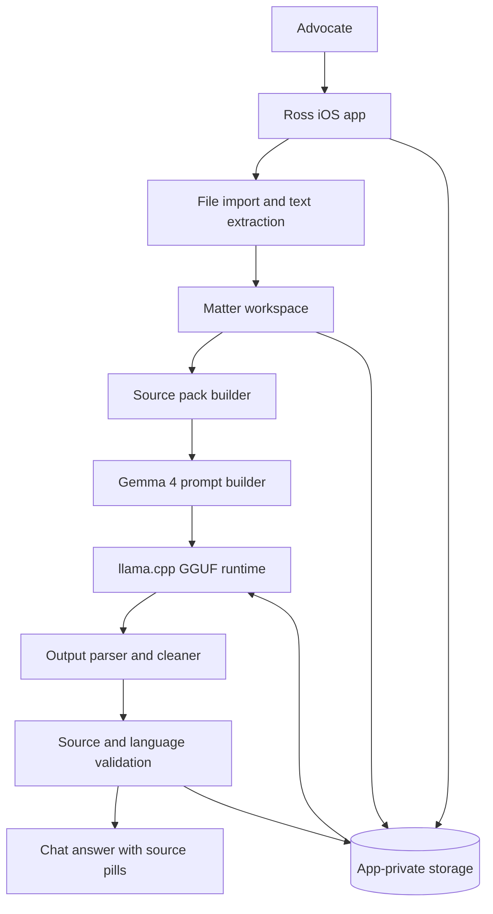
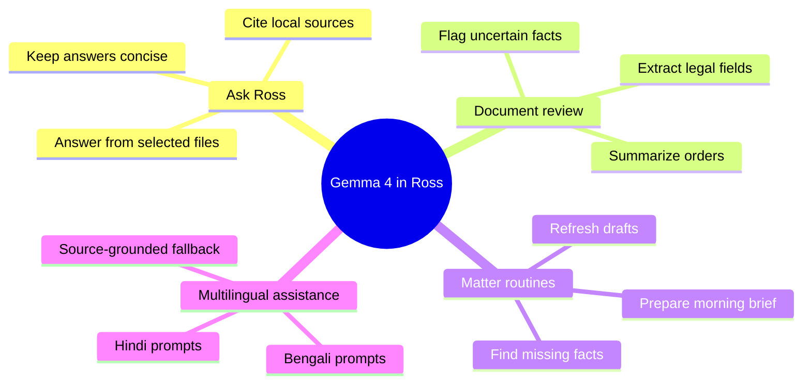
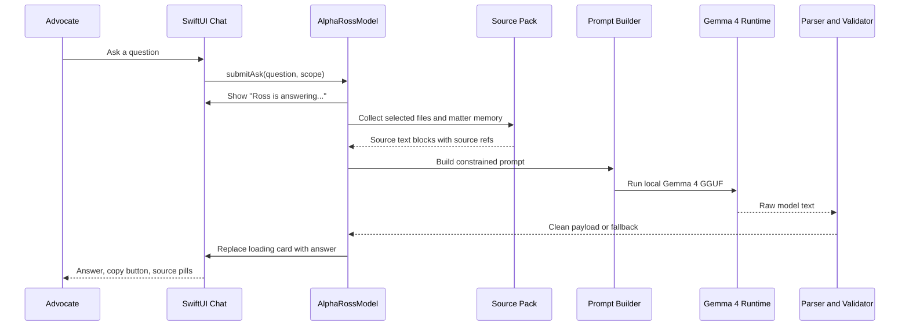
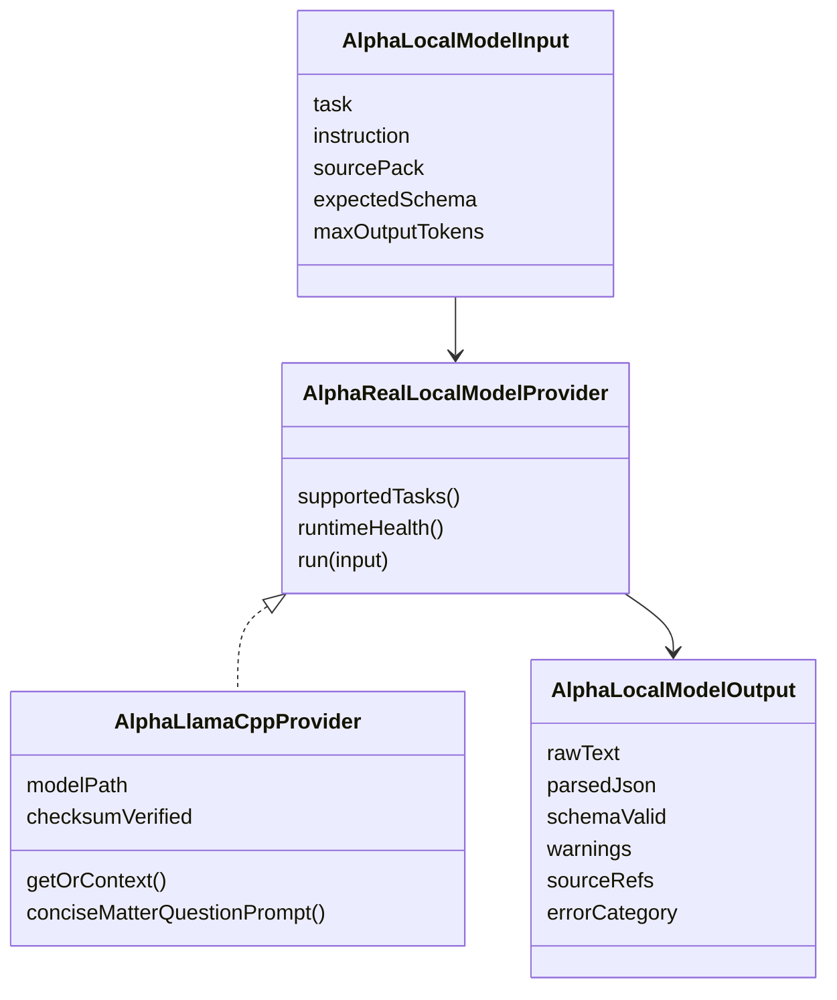
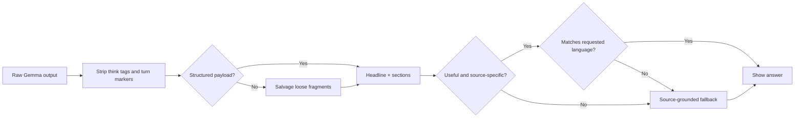

# How Ross Uses Gemma 4 for Private Legal Work

This article explains how Ross uses Gemma 4 as an on-device legal assistant for private matter workflows. It is written as a technical implementation guide: a reader should be able to understand the product architecture, reproduce the pattern in another app, and appreciate the small details that make local model answers useful instead of just impressive demos.

Ross is not using Gemma 4 as a generic chatbot. The model is one part of a local legal workbench that imports files, extracts text, builds a source pack, asks Gemma 4 a constrained question, validates the answer, and shows citations back to the advocate.

## The Core Idea

Legal matter files are sensitive. Sending them to a cloud LLM is often unacceptable because the documents may contain privileged facts, client identities, evidence, deadlines, and litigation strategy. Ross therefore treats Gemma 4 as a local private assistant: the model file lives in app storage, inference happens on the device, and matter text stays inside the iOS sandbox.

The architecture has three important rules:

1. The model only receives local source text selected or retrieved by Ross.
2. The model output is treated as untrusted until parsed, checked, and source-backed.
3. The UI tells the user when the private assistant is running and when advocate review is still needed.

## High-Level Architecture



The important design choice is that Gemma 4 does not own the whole product loop. Ross owns the workflow, privacy boundary, source selection, parser, UI state, and fallbacks. Gemma 4 is the reasoning engine inside that controlled loop.

## The Four Capability Packs

Ross exposes assistant tiers in user-friendly language. Internally, those tiers map to different Gemma 4 model sizes and quantizations.

| Product tier | Technical role | Intended use |
| --- | --- | --- |
| Flash | Fastest local answers | Short prompts, simple summaries, quick checks |
| Small | Short order review | Lightweight file Q&A and simple matter notes |
| Standard | Everyday matters | Source-grounded answers, chronology help, issue extraction |
| Full | Long bundles and drafting | Heavier drafting and multi-document review on capable hardware |

The user does not need to learn GGUF, quantization, llama.cpp, checksums, or context windows. The UI says what each tier is good for. Technical diagnostics can still reveal the runtime details for developers and QA.

## What Gemma 4 Does in Ross

Gemma 4 supports several workflows, but each is routed through a specific product action.



### Why Multilingual Support Matters

For India, multilingual legal assistance is not a nice-to-have UI feature. It is basic access infrastructure. The country has 22 constitutionally scheduled languages, and Census language tables track far broader linguistic diversity across mother tongues and language rows. A client may describe facts in Hindi, Bengali, Tamil, Marathi, Assamese, or another local language while the pleading, order, or exhibit remains in English. Advocates often have to translate, summarize, and explain across those boundaries under heavy workload.

Ross uses Gemma 4 for this bridge while keeping the same privacy rule: the matter files stay local, the source pack stays local, and the model answer is checked before display.

<p align="center">
  
  
</p>

The official Gemma 4 model card describes 35+ languages supported out of the box and pre-training over 140+ languages. Google does not publish a public exhaustive list of every one of those 140+ language names on the model card, so Ross documents the source link and separately tracks the language flows we have verified in-product.

| Language scope | Ross implementation detail | Reference |
| --- | --- | --- |
| Gemma 4 multilingual coverage | Use Gemma 4's official 35+ out-of-the-box and 140+ pre-training coverage as the product baseline. | [Gemma 4 model card](https://ai.google.dev/gemma/docs/core/model_card_4) |
| India scheduled languages | Prioritize UX and QA for India's 22 scheduled languages: Assamese, Bengali, Bodo, Dogri, Gujarati, Hindi, Kannada, Kashmiri, Konkani, Maithili, Malayalam, Manipuri, Marathi, Nepali, Oriya/Odia, Punjabi, Sanskrit, Santhali, Sindhi, Tamil, Telugu, Urdu. | [Government of India language provisions](https://www.education.gov.in/en/constitutional-provision-1) |
| Ross verified simulator flows | English, Hindi, and Bengali prompts have successful local Gemma answer screenshots with source pills. | `docs/images/gemma_hindi_answer.png`, `docs/images/gemma_bengali_answer.png` |

The most visible workflow is Ask Ross. A lawyer can tag files, ask a question, and receive an answer grounded in those files. Under the hood this is a local model task named `matterQuestionAnswer`.

Key implementation files:

- `ios/Ross/AlphaFoundation/AlphaRossModel+Ask.swift`
- `ios/Ross/AlphaFoundation/AlphaLlamaCppProvider.swift`
- `ios/Ross/AlphaFoundation/AlphaLlamaCppEngine.swift`
- `ios/Ross/AlphaFoundation/AlphaLocalModelRuntime.swift`
- `ios/Ross/AlphaFoundation/AlphaPrivateAIViews.swift`

## End-to-End Ask Ross Flow



This flow deliberately separates user-visible chat from model execution. The app first creates a pending turn, then upgrades that turn when the local model result returns. That gives the user a responsive UI even when local inference takes a few seconds.

## Building the Source Pack

Gemma 4 performs best when the prompt is short, explicit, and source-grounded. Ross therefore does not dump the entire matter into the model. It creates a compact source pack from:

- Explicitly tagged files in the chat composer.
- The active matter's saved details.
- Recent imported documents.
- Page-level extracted text.
- Source refs that can be shown back as citation pills.

The source pack is assembled in `askRuntimeSourcePack(...)` inside `AlphaRossModel+Ask.swift`.

The subtle part is that explicitly selected files are allowed into the source pack even if their classification blocks automatic legal fact saving. That distinction matters. A file can be unsafe to auto-save into matter memory while still being safe to answer from when the user explicitly tags it.

## Prompt Shape

Ross uses a narrow prompt for matter Q&A instead of a generic legal assistant prompt.

The prompt says, in effect:

```text
You are Ross, a private legal assistant running locally on this device.
Use only the SOURCES below. Do not invent facts.
Match the advocate's language exactly.
Do not output JSON, XML, markdown fences, or chat template tokens.
Write a short heading and 2 to 4 useful bullet points.
Cite local source labels.
```

That prompt is generated by `conciseMatterQuestionPrompt(for:)` in `AlphaLlamaCppProvider.swift`.

Why this works:

- "Use only the SOURCES" narrows the answer space.
- "Do not invent facts" reduces unsupported legal claims.
- "Do not output JSON" prevents raw structured text from leaking into chat.
- "Match the advocate's language exactly" supports Hindi and Bengali workflows.
- "Cite local source labels" preserves trust and reviewability.

## Runtime Provider Design

The runtime contract lets Ross switch providers without rewriting product logic.



The app resolves the provider through `AlphaLocalModelRuntime.resolveProvider(...)`. If a real local pack is active, Ross uses the llama.cpp provider. If not, the app falls back to safe deterministic behavior for tests and non-model workflows.

## Output Parsing and Validation

Model output is never trusted directly. Ross has to handle at least five classes of output:

1. Clean prose.
2. JSON-shaped answers.
3. Malformed JSON.
4. Chat template token leakage.
5. Low-quality or irrelevant text.

Ross normalizes this through `AlphaMatterAskPayloadParser` and validation helpers in `AlphaRossModel+Ask.swift`.



The validation layer is what turns a local model demo into a product feature. A model can run successfully and still produce an answer that is not acceptable for a legal workflow. Ross checks the output before showing it as final.

## Multilingual Behavior

Ross detects the user's requested language from the prompt script:

- Devanagari script means Hindi answer.
- Bengali script means Bengali answer.
- Otherwise, Ross defaults to English.

The language check matters because small local models sometimes answer in Hinglish when the user asks in Hindi. Ross now rejects Hindi outputs that are mostly Latin text and falls back to a Hindi source-grounded answer in Devanagari script.

This logic lives in:

- `alphaAnswerLanguage(for:)`
- `alphaPayloadMatchesRequestedLanguage(...)`
- `alphaIndicScriptRatio(...)`
- `alphaLatinWordCount(...)`

## UI Integration

The chat UI is designed around local inference latency. The user should never wonder if the app froze.

When Gemma 4 is running, Ross shows:

```text
Ross is answering...
Gemma 4 E2B Q2_K is running on this iPhone
Ross is checking your local files and will replace this loading state with the final answer.
```

When the answer arrives, the loading card is replaced with:

- A short headline.
- Clean answer sections.
- A copy button.
- A single `Sources` area.
- Horizontally scrollable source pills.

That UI behavior lives mostly in `AlphaAskConversationScreen.swift` and the Ask dock components.

## Implementation Recipe

If you want to copy this architecture into another iOS app, use this recipe:

1. Create a local model runtime protocol with explicit input and output structs.
2. Store model packs in app-private storage, not in the app bundle.
3. Build a source pack before calling the model.
4. Keep prompts task-specific and short.
5. Show a pending UI state before inference begins.
6. Strip special tokens and parser artifacts from model output.
7. Validate answer quality before showing the result.
8. Fall back to deterministic source-grounded text when the model output is unusable.
9. Keep citations as first-class data, not plain text decoration.
10. Test on the real simulator/device path, not only unit tests.

## What Makes This Product-Ready

The hard part was not only "running Gemma 4." The hard part was making model execution fit a legal product:

- Privacy: no private matter text leaves the device.
- Trust: every answer points back to source refs.
- Reliability: invalid model output does not leak into the UI.
- Performance: the app remains responsive while the model runs.
- Recovery: setup, download, runtime, and parsing failures have user-facing fallbacks.
- Multilingual support: Hindi and Bengali prompts get language-appropriate answers.

That is the core lesson from Ross: local LLMs become useful when they are embedded into a careful product system, not when they are treated as a standalone chatbot.

## References

- [Gemma 4 model card](https://ai.google.dev/gemma/docs/core/model_card_4)
- [Government of India: Constitutional provisions for languages](https://www.education.gov.in/en/constitutional-provision-1)
- [Census of India C-16 mother tongue table](https://censusindia.gov.in/nada/index.php/catalog/10191)
